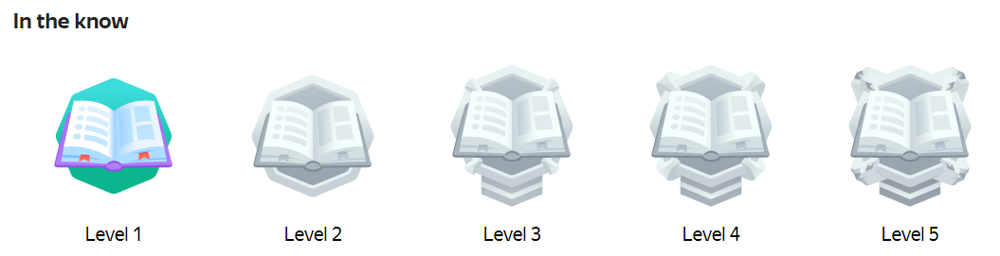

# Awards

The Awards section tracks your achievements for completing tasks and inviting friends.



Visit this [page]({{ toloka-achievements }}) to view the full list of achievements. It's also a great way to discover new Toloka features.



At the top left, click ** → {{ mobile_android_nav_title_achievements }}**



For a list of awards, go to **{{ mobile_ios_profile }} → {{ mobile_ios_achievements_awards_title }}**



# |
|| Awards earned — colored         | Available awards — black and white        ||
||   |   ||
|#

Click on the award icon to find out how to earn it.

## Types of awards {#section_qsd_fmr_r3b}

- **For knowledge of Toloka.** Complete a training task, field task, or mobile task, earn your first money, and withdraw it from your Toloka account.
- **For activity.** Users get these awards for performing different actions on the platform. Like turning on push notifications or inviting friends to Toloka.
- **Multilevel awards** are given for reaching a certain skill level. With each new level, you get a new award.

   

   The "In the know" Level 1 award is given for completing 10 training tasks. Level 2 is awarded for completing 100 training tasks, and so on. Level 5 is the highest.

   

   

- **Secret** awards are not visible in the profile and are issued as a surprise.

