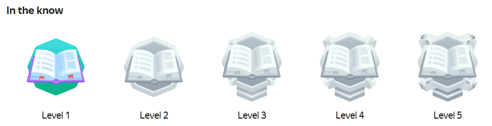

# Awards

The Awards section tracks your achievements for completing tasks and inviting friends.

Visit [this page]({{ toloka-achievements }}) to view the full list of awards. It's also a great way to discover new Toloka features.



Click the  → **Achievements** → **Awards** icon at the top left.



To view the list of awards, go to  **Profile** → **Awards**.



| The awards you earned are in color | The available awards are black and white |
| :----: | :----: |
|  | |

Click on the award icon to find out how to earn it.

## Types of awards {#section_qsd_fmr_r3b}

- **For knowledge of Toloka.** Complete a training task, field task, or mobile task, earn your first money, and withdraw it from your Toloka account.

- **For activity.** Users get these awards for performing different actions on the platform, like turning on push notifications or inviting friends to Toloka.

- **Multi-level awards** are given for reaching a certain skill level. With each new level, you get a new award.

    

    You get the first level of the "In the know" award for completing ten training tasks; the second level is awarded for completing one hundred training tasks, and so on. The fifth level is the highest.

    

    
    
- **Secret** awards are not visible in the profile and are issued as a surprise.

