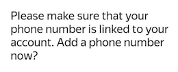
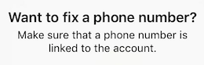
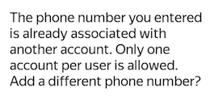

# Registration and logging in

## I am registered in Toloka {#registered}

1. Open [Toloka]({{ toloka }}).
  
1. Click **Log in**  **Join** .
  
1. Choose an account and tap **Continue** or enter your username and password.

If you don't remember your username or password, go to the [Restore access]({{ passport-restore }}) page.



After logging in to the app, start [completing tasks](tasks.md).



After opening the app, [adjust settings](settings.md) and begin [completing tasks](tasks.md).



## I am registered in Yandex, but not in Toloka {#no-toloka}

1. Open [Toloka]({{ toloka }}).
  
1. Click **Log in**  **Join** .
  
1. Choose an account or enter your username and password.
  
1. If a warning appears on the registration screen:
    
    

        

    Tap  **OK**  **Go**  and link the phone number on the page that opens in [Yandex ID]({{ passport }}). We need your number to send the SMS code.

    
    
    
    
        

    A user with the phone number specified in your account is already registered in Toloka. Check the number in [Yandex ID]({{ passport-phones }}).
    
    If the wrong number is linked, change it. For more information about linking a phone number, see [Yandex ID Help]({{ support-passport-phone }}).
    
    If the number is correct, it means you didn't previously register in Toloka with another username. Use [Restoring access]({{ passport-restore }}).
    
    
    
    According to the [User Agreement]({{ user-agreement }}), a user can have only one account in Toloka.
    
    

    
    
1. Fill in the profile information.
    
1. Accept the User Agreement and click **Register****Done**.



After logging in to the app, start [completing tasks](tasks.md).



After opening the app, [adjust settings](settings.md) and begin [completing tasks](tasks.md).



## I don't have a Yandex ID {#no-yandex}

1. Open [Toloka]({{ toloka }}).  
  
1. Click **Log in****Join**.  
  
1. Tap **Create a new account** to register in Yandex.Tap **Registration** to create a Yandex ID. Be sure to enter your mobile phone number. We need it for sending the SMS code.  
  
1. [Register](#no-toloka) in Toloka.

## Frequently asked questions {#faq}

[I can't get an SMS with the confirmation code](#no-sms)

[I had an account in Toloka. Now I can't register because the number "belongs to another user"](#phone-warning)

[How do I change the phone number in my account?](#change-phone)

[Where do I find my username in the web version of Toloka?](#login-web)

[Where do I view my username in the mobile app?](#login-mobile)

### I can't get an SMS with the confirmation code {#no-sms}

Follow the recommendations in [Help for Yandex ID]({{ support-passport-nocode }}). If this doesn't help, contact [support]({{ support-passport-nosms-form }}).

### I had an account in Toloka. Now I can't register because the number "belongs to another user" {#phone-warning}

If you don't remember your credentials in Toloka, use [Restoring access]({{ passport-restore }}).

If you deleted your account in Toloka, you can't register again or restore the deleted account.

According to the [User Agreement]({{ user-agreement }}):

- The user may have only one account in Toloka.
- The user must have a unique phone number.

### How do I change the phone number in my account? {#change-phone}

To change your phone number, go to Yandex ID and change your main number.



If you don't have access to the old number, it takes a month to change it. For more information about changing your phone number, see the [Yandex ID Help]({{ support-passport-phone-change }}).



### Where do I find my username in the web version of Toloka? {#login-web}

In the web version of Toloka, your username is shown in the upper-right corner, next to the avatar. If your name or nickname is displayed next to the avatar, click on the avatar. The username will be shown in the window that opens.

### Where do I view my username in the mobile app? {#login-mobile}



Open the menu by tapping  at the top of the screen. Your username is at the top next to the avatar.

Tap . You'll see your username in the **Profile** section.



Open your **Profile**. Your username is under your name.



