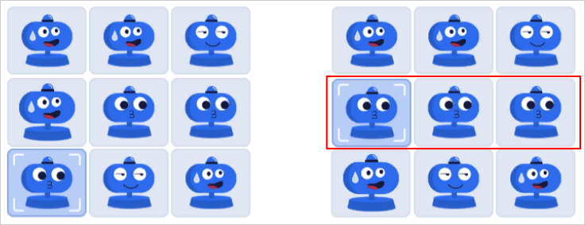
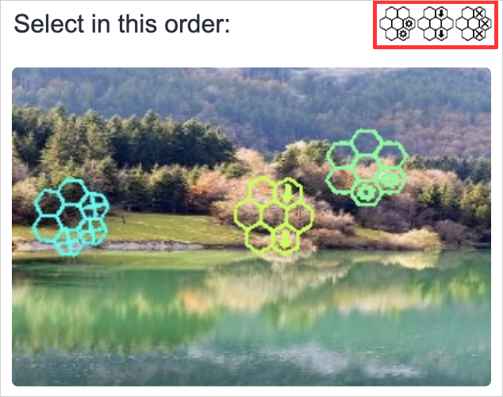

# Entering captchas

In Toloka, captchas are entertaining mini games that can distract you from your tasks for a few seconds. The games are simple, quick, and easy. The captchas don&apos;t contain any foreign words, only pictures and clear symbols. At the same time, captchas are good at protecting Toloka from robots and cheaters.

## Примеры капчи {#example-captcha}

- **Three in a row**

  In this captcha, you need to put three identical images in one row or column. To move an element, click it, then click the cell that&apos;s above it, under it, to the right, or to the left from it. This mini game always has a solution where it&apos;s enough to move one element to line up three identical images.

  

- **Select objects**

  In this captcha, you need to select objects in a given order.

  

- **Slider**

  To solve this captcha, move an element to the right place. To do this, click the slider, hold, and move it. Don&apos;t release the mouse button until the element is in the right place.

  


## Troubleshooting {#troubleshooting}





If you encounter a problem when entering a captcha and you didn&apos;t find the answer on this page, contact Toloka support. Attach a screenshot or screen recording to your message and specify the OS, browser, or app version.

