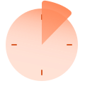
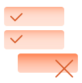
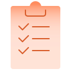
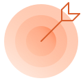


# Toloka for iOS



# Toloka for Android



# About Toloka




[About](./about.md)

[Registration and logging in](./auth.md)

[Choosing a task list](./task-select.md)

[How to be a successful Toloker](./tasks.md)

[Tasks under review](./priemka.md)

[Profile](./profile.md)

[Messages](./messages.md)

[Skills](./skills.md)

[Withdrawal methods](./pay/about.md)

[Troubleshooting and support](./troubleshooting/troubleshooting.md)













[Toloka]({{ toloka }}) is a platform where you [get paid](./priemka.md#pay) for [completing](./tasks.md) tasks.

If you are looking for Mobile Help:  [Android]({{ toloka-app-android }}),  [iOS]({{ toloka-app-ios }}).

#|
||

[Register as a Toloker](./register.md)
Registration. FAQ.

|

[Withdrawing money](./pay/about.md)
Withdraw the money you earned.

||

||

[How are my responses reviewed?](./priemka.md)
Learn how long the review takes. How to find out the results. 

|

[Choosing a task list](./task-select.md)
How to sort tasks using filters. 

||

||

[Set up a profile](./profile.md)
Setting up a profile. Notifications.

|

[Skills](./skills.md)

What you need skills for and where you can see them. 

||

||

[How to be a successful Toloker](./tasks.md)
How to earn honestly and what not to do.

|

[Achievements](./achievements.md)
Get awards for your achievements on the platform. Can you get them all?

||

||

[How to contact the requester](./messages.md)
Feedback for the requester.

|

[Invite your friends](./referal.md)
What rewards are available. Rules for calculating rewards.

||
|#

Follow us in social media
   
   

