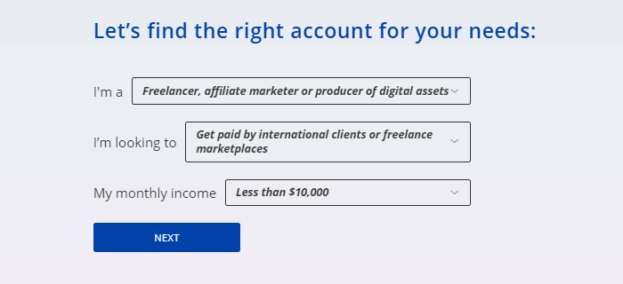

# Payoneer



Funds withdrawal to Payoneer is currently unavailable for users from Russia.



#### Benefits of Payoneer

Payoneer is a secure, fast, and low-cost payment system.

It allows users to:

- Send and receive money.
- Pay for goods and services.
- Send payment requests.
- Open multiple accounts in different currencies within the same account.

#### Terms







#|
|| Area of operation |



Available in more than 200 countries. For more information, contact the [Payoneer Support Center]({{ payoneer-support }}).



||
|| Total fee |

{% cut "2%" %}

#### Fees

- From Toloka — 0%.
- To your bank account — up to 2%.
- To a bank account in the same currency. USD — $1.5, EUR — €1.5, GBP — £1.5.

Learn more on the [Payoneer website]({{ payoneer-fees }}).



||
|| Minimum withdrawal amount from Toloka | $20 ||
|| Where to transfer money next |
 - To a bank account.
 - To the Payoneer Mastercard.

To find out the exact fee amount, go to **Fees** in your Payoneer account.

The minimum withdrawal amount may differ from the one when withdrawing from Toloka. It might be higher (for example, $50). ||
|#



## How to connect Payoneer {#how-to-use}

To withdraw money from Toloka to Payoneer, you need to register in the system.

1. Go to the [Payoneer]({{ payoneer }}) official website and click **Зарегистрироваться****Register**.
1. Answer a short survey on how you intend to use **Payoneer**.

    

    

    

1. On the next page, click **Register****Register**.
1. Fill in your personal data. Click **Next****Next**.
1. Enter your contact details. To confirm your phone number, click **Send code** and enter the code from the SMS.
1. Come up with a password and fill in your personal data as shown in your passport.
1. Enter your local bank account details.
1. Done! You have registered in Payoneer. After registration is completed, you'll get a confirmation email.

## How to withdraw money from Toloka {#withdraw-from-toloka}


1. Open the **{{ mobile_ios_profile }}** page.
   
1. Open the [My money]({{ toloka-money }}) page.
1. Find the **Payoneer** payment system and click **{{ ui_worker_money_PAYONEER__button-link-account }}**.
1. The wallet is linked once. After you do this, you'll be able to withdraw money in the **{{ ui_worker_prfl-tab-money }}****{{ mobile_android_money_main_title }}****{{ mobile_ios_profile_my_money_section_header }}** tab.
1. Enter the required amount and click **{{ ui_worker_money__withdraw__submit }}**.
1. An SMS with a code will be sent to your number. Enter it and click **{{ ui_worker_sms_popup__submit }}****{{ mobile_android_button_confirm_sms }}**.
1. The money will be transferred to your Payoneer account. It usually takes a few hours or days, but sometimes longer. The maximum transfer time is 30 days. Check the status in the **{{ ui_worker_prfl-money-history }}** block.



## How to withdraw money from Payoneer {#withdraw-from-payoneer}



1. Go to **Withdraw → To Bank Account****Withdraw → To Bank Account**.
1. Select the relevant currency balance: dollars or euros.
1. Enter your bank account details if you haven't done so already. If the account is already linked, select it from the list.
1. Enter the amount and click **Review****Review**.
1. Check the details and click **Withdraw**.
1. After the request is processed, you will receive a notification email specifying the amount of time the transfer will take.





You can withdraw money at ATMs all over the world. To do this, request a Payoneer Mastercard under **Settings → Card management → Order now**.



Payoneer does not issue cards to customers with a postal or residential address in the Russian Federation.



- You can order the card after you reach a certain payment amount.
- The card is issued free of charge, but there is a service fee.
- You can order a card for each of the currencies you use.
- The money is automatically transferred from the Payoneer account to the card every hour, provided that the amount of funds on it doesn't exceed the set limit.

Learn more about the card in the [Payoneer Support Center]({{ payoneer-card }}).



