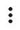

# Tasks under review

Some tasks undergo a review. The requester can reject a task if it isn't completed according to the instructions. Rejected tasks are not paid for.

## How long does the review take? {#deadline}

The review may take several days. The maximum and average review period is specified in the task information.

## How do I get the results? {#result}


The history of completed tasks can be viewed on the page [**Profile → History**]({{ toloka-profile-history }}).


To view your results, go to the  page. There you can view the full history of completed tasks (total earnings and the number of accepted and rejected tasks), as well as statistics for the day. To view statistics, click the button with the number of completed tasks next to the date.


To view your results, go to the **My tasks** → **Done page**. There you can view the full history of completed tasks (total earnings and the number of accepted and rejected tasks), as well as statistics for the day. To view statistics, click the button with the number of completed tasks next to the date.


If your task is rejected, you can't complete it again. You can [challenge the review result](#appeal).

## When are the accepted tasks paid for? {#pay}


After review, payment for accepted tasks is credited to your account. The amounts are indicated on the right of [Toloka's]({{ toloka }}) top menu :


After review, payment for accepted tasks is credited to your account. The amounts  are indicated in the upper part of the menu (the  icon):


After review, payment for accepted tasks is credited to your account. To view your account balance, open your **Profile**. The amount for the tasks that are currently under review is indicated separately.



- Gray indicates the amount for tasks that are currently under review.
    
- Green indicates money on your Toloka account.
    



To view the earnings history, go to the **My money** → **Earnings page**. It shows the list of accepted tasks with the date and amount.


To view your earnings history, open **Earnings**. It shows the list of accepted tasks with the date and amount.


## How to challenge the review result {#appeal}

You can appeal to the requester within 7 days after the review.

For each rejected task, you must submit a separate appeal.


1. Go to the [**Profile → History**]({{ toloka-profile-history }}) page.
    
1. Choose **Rejected** in the drop-down list above the **Completed tasks in the last 2 months** table.

1. Click the project.

1. Open the rejected task by clicking on its number.

1. Click the  → **Contact requester** button at the top of the page.

1. Describe briefly why you think the task was completed correctly. The task number is attached to the message automatically.

1. Tap **Submit**.


1. Go to the **My tasks** → **Done** page.
    
1. Open the rejected task.

1. Click **Contact requester**.

1. Describe briefly why you think the task was completed correctly. The task number is attached to the message automatically.

1. Tap **Submit**.


1. Go to the **My tasks** → **Done** page.

1. Open the rejected task.

1. Click  in the task card and select .
    
1. Describe briefly why you think the task was completed correctly. The task number is attached to the message automatically.

1. Tap **Submit**.


The requester will respond to the appeal within 14 days.



Don't send repeated requests or ask for a faster response. This will just move your request to the end of the queue, since messages are automatically sorted by time received.



#### If you can't contact the requester or something doesn't work {#support}

