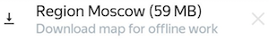

# Required settings

- Choose the [internet usage mode](#internet).

- Turn on [push notifications](#notifications-android)[push notifications](#notifications-ios) to instantly learn about events.


- Download a [region map](#map) if you are planning to complete field tasks while offline.
   

- Turn on [geotags in the camera settings](#camera)[Turn on geo location display](#camera-ios) if you plan to complete field tasks.


- Install the [app to add multiple photos](#google).
   

## Internet {#internet}

Choose the internet usage mode depending on the tasks you are planning to complete:
1. Open the menu by tapping  at the top left of the screen. Open the **{{ mobile_ios_more_title }} → {{ mobile_ios_settings_screen_title }}**.
    page.
1. Select **{{ mobile_android_settings }}**.
   
1. Set the type of internet connection depending on the task type:
   #### Field tasks

   You can complete field tasks without permanent internet connection. You only need the internet to choose and reserve tasks and send responses.

   - Wi-Fi only — Turn on **{{ mobile_android_settings_wifi_title }}**.

   This option saves cellular data. Your responses are stored on your device and are submitted as soon as Wi-Fi is available.

   

   You need to make sure your responses are submitted before the task time expires.

   

   - Wi-Fi or mobile network — Turn off **{{ mobile_android_settings_wifi_title }}**.

   This option means you can send responses immediately after you complete tasks, as soon as you are connected to the internet.

   #### Non-field tasks

   Non-field tasks require a constant internet connection.

   - Wi-Fi only — Turn on **{{ mobile_android_settings_wifi_title }}**.

   - Wi-Fi or mobile network — Turn off **{{ mobile_android_settings_wifi_title }}**.


## Notifications {#notifications-android}

Choose which notifications you want to receive and how you want to receive them:

1. Open the menu by tapping  at the top left of the screen.
1. Select **{{ mobile_android_settings }}**.
1. Go to the **{{ mobile_android_notifications_title }}** block.
1. Turn on the notification and tap **{{ mobile_android_action_save }}**.
   
   
## Notifications {#notifications-ios}

Choose which notifications you want to receive and how you want to receive them:
1. Tap **{{ mobile_ios_more_title }} → {{ mobile_ios_notifications_preferences_title }}**.
1. Choose a notification and enable the desired option.
   


## Area map {#map}

To use the map without an internet connection, download a map of the area to your device.
1. Open the menu by tapping  on the left.
1. Select **{{ mobile_android_settings }}**.
1. Turn on the **{{ mobile_android_settings__download_maps__title }}** option.
1. Select  → **Available** → **Available**.
1. Tap  to go to tasks on the map.
1. Tap  at the bottom of the screen and save the map:

   

To update the downloaded map automatically:

1. Open **{{ mobile_android_settings }}**.
1. Turn on the **{{ mobile_android_settings_offline_maps_auto_update__title }}** option in the **{{ mobile_android_support_help_settings_maps_group }}** section.

To delete downloaded maps:
1. Open **{{ mobile_android_settings }}**.
1. Tap **{{ mobile_android_clear }}** in the **{{ mobile_android_support_help_settings_maps_group }}** section.
   
   
## Camera {#camera}

Many  field tasks require you to photograph something (for example, a store's sign). All photos must contain the location information. Otherwise, the requester will reject your response. To save your location in photos:
1. Open the  **Camera** Camera app on your device.
1. Tap  to open the settings.
1. Enable **Location tags**/**Geo tags****GPS location info**.

   

   Allow access to your location as the system prompts you to.

   

If photos in responses are sent too slowly, choose a lower resolution in the camera settings, but not less than 3 megapixels.


## Camera {#camera-ios}

Many field tasks require you to photograph something (for example, a store's sign). All photos must contain the location information. Otherwise, the requester will reject your response. To save your location in photos:
1. Go to the device **Settings**.
1. Go to the **Geolocation services** block and allow geolocation access for the **Camera** app.
   
   
## Gallery {#google}

In some field tasks, you need to attach several photos at once (for example, the front of a building and the sign). If **{{ mobile_android_support_help_settings_images_gallery_title }}** doesn't support choosing multiple photos, install the [Google Photos]({{ googleplay-android-photos }})[Google Photos]({{ googleplay-android-photos }}) app.



