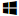

# Troubleshooting

Choose the problem you have:





Contact the [support service]({{ support-passport-nosms-form }}).





Your phone number can only be linked to one [Toloka](https://toloka.ai/tolokers/) account at a time. Most likely, you already registered in the system using a different social network. Try to remember it. If you have any problems, contact the [support service]({{ support-passport-nosms-form }}).

According to the [User Agreement]({{ user-agreement }}):

- The user may have only one account in Toloka.
- Re-registration is prohibited.
- The user must have a unique phone number.





1. Log in to the web version of [Toloka]({{ toloka }}).
2. Go to the **Profile** tab.
3. In the **Telephone** block, click **Edit**.
4. Enter a new phone number and click **Confirm**. We will send a text message to this phone number.
5. Enter the code from the text message and click **Confirm**. If you haven't received the code or entered an incorrect one, click the **Request a new code** link. You can request a new one in a minute.



After changing the number, the withdrawal of funds will be blocked for 7 days.







In the web version of Toloka, your username is shown in the upper-right corner, next to the avatar. If your name or nickname is displayed next to the avatar, click on the avatar. The username will be shown in the window that opens.





If you use the Toloka mobile app, choose the platform:



- Android

  Open the menu by tapping  at the top of the screen. Your username is at the top next to the avatar.

  Tap . You'll see your username in the **{{ mobile_android_profile }}** section.

- iOS

  Open your **{{ mobile_ios_profile }}**. Your username is under your name.







If you don't remember your password, restore it in the social network with which you registered on the platform. Toloka doesn't store any passwords.





According to the [User Agreement]({{ user-agreement }}):
- You can only have one account.
- You can't restore a deleted account.
- You can't register in [Toloka]({{ toloka }}) a second time.





[Fill out the form](support.md#contact)



Please don't send duplicate requests or ask for a faster response. The support service reviews all incoming requests. You will receive a reply within a few days.









Under [How to be a successful Toloker](../tasks.md), we describe the most frequent causes of bans and offer tips on how to prevent them

If you get a ban, you will receive two messages:
1. An automated notification indicating the ban.
1. An administrator's message regarding the potential for unblocking.

If recalling the ban is possible, follow the instructions outlined in the message and await a decision, which typically takes several days to review.







Not all skills are displayed in your profile. It depends on the skill settings and the type of project.





No. Transferring your account to another person is a violation of Section 5.2 of the [User Agreement]({{ user-agreement }}).





Awards can help you track your achievements and discover more Toloka features.





Awards are given within 24 hours after you achieve the desired result. If the award doesn't appear in your profile within a few days, please contact the Toloka support service.









The list of projects shows the projects available to you at the moment. Each of them has a short description and price. Choose a project and complete it.





Training projects are generally not paid for. They are used to teach Tolokers to perform a particular kind of project and select those who show the best results. You get access to the main, paid project only after you successfully complete the training.





The cost of the project directly depends on its complexity and how much time it takes to complete it. Simple projects that don't require special skills and a lot of time cost less than more complex ones. But the better you cope with them, the higher their cost will be and the more chances there are to get a bonus from the requester.





The maximum earnings displayed in the project card show how much three of the most active Tolokers earn on average per day.
The average earnings displayed in the project card show how much you can earn on the project per hour on average.





After the expiration of the allotted period, the reservation is automatically removed and the projects return to the main page. You can remove the reservation manually. To do this, go to the project, click **←** and select **{{ mobile_android_dialog_going_back_negative }}****{{ mobile_ios_task_action_refuse }}**. The option to reserve projects is provided for Tolokers' convenience. If for some reason you can't complete the projects you have reserved, it doesn't affect the availability of other projects or your performance in [Toloka]({{ toloka }}).







According to the [User Agreement]({{ user-agreement }}), projects in Toloka may contain "adult" (including pornographic) content. Your actions in [Toloka]({{ toloka }}) that have to do with evaluating "adult content" don't violate the law. The Toloka service operates in accordance with the legislation of the Swiss Confederation and is aimed, among other things, at identifying materials of an offensive or pornographic nature. If this type of material is unacceptable to you, turn off the **{{ ui_core_profile_editor__label__allow_adult }}** option in the [profile]({{ toloka-profile }})profile.





Projects in which Tolokers are asked to record a video or audio or take a photo are not prohibited in [Toloka]({{ toloka }}). If for some reason you don't want to complete this type of project, select another project from the list of available projects.





Projects in which Tolokers are asked to record a video or audio or take a photo are not prohibited in [Toloka]({{ toloka }}). If for some reason you don't want to complete this type of project, select another project from the list of available projects.





Requesters check their projects before posting and try to make sure they don't contain malicious links. The virus can only appear if the content of the site you access from the project has changed after the project was posted. According to Section 4.7 of the [User Agreement]({{ user-agreement }}), Toloka does not guarantee that projects won't contain viruses and other malicious components. When completing projects, the Toloker is solely responsible for the consequences of using the Toloka platform, including the damage that may be caused to software or hardware. If you encounter an infected site, notify the author of the project immediately.



Install antivirus software to prevent threats. This will be useful not only for completing projects in [Toloka]({{ toloka }}) but also for visiting other sites.







If you encounter projects in an unfamiliar language, don't complete them.







Projects are posted and checked by requesters. If you have a question about the completion of a particular project, contact the requester directly. To do this, find the project in the **Available**, **Reserved**, or **Done** section, open the project, click on the three dots in the upper-right corner, and select **{{ ui_worker_messages_compose_to_requesters }}**.



If you receive spam, or if someone tries to obtain your contact information or suggests installing any programs, [write to the support service](support.md#contact).



Please don't send duplicate requests or ask for a faster response. The support service reviews all incoming requests. You will receive a reply within a few days.











When requesters review projects, they primarily check whether they are completed according to the instructions. However, according to Section 3.5 of the [User Agreement]({{ user-agreement }}), you can't submit photos or videos of third parties or car license plates. Therefore, it doesn't matter whether the requester accepts the project or not. Your account might still be blocked for violation of the User Agreement, and you won't be able to withdraw money from Toloka (Section 8.5.3). Therefore, carefully check the photos and videos you're submitting for whether they contain vehicle number plates or other people's faces.
If the project asks you to take photos of strangers or car license plates, don't complete it and contact the Toloka support service. We will check the project, suspend it, or ask the requester to make changes to it so that the project complies with [Toloka]({{ toloka }}) rules.





According to the law, you are allowed to take photos on the street and in stores and transfer this information to third parties.





According to Section 5.8 of the [User Agreement]({{ user-agreement }}), you work for Yandex as an independent contractor. Therefore, you can't use the logo, badge, or another ID that indicates your professional affiliation with Yandex or [Toloka]({{ toloka }}).





The photos you take help improve map services and make online maps and directories more complete, useful, and up-to-date.





If the employees of organizations ask you what you're collecting information for, explain that you're completing a project on the [Toloka]({{ toloka }}) platform. Your goal is to verify information about a business's presence at a certain address and its working hours. The accuracy and reliability of this information is in the interests of the organization itself, because it will be published in directories and on online maps. If the employees of organizations tell you that you're filming illegally, explain that you're not collecting any personally identifiable information such as people's faces and car license plate numbers. All photos will be further processed according to all applicable privacy laws. If the employees of organizations don't allow you to enter the building and take photos, try to politely explain the legality of your actions. If this doesn't help, don't get into a conflict, and refuse the project.





If you can't complete the project according to the instructions, refuse it.





The availability of field projects in specific cities depends on a number of factors: the needs of requesters, the epidemiological situation in the region, and so on. If there are currently no field projects in your city, it means that requesters have suspended their placement for some reason. Check the map from time to time. You'll see the projects when they appear.







If the project you liked is no longer displayed, it may have already been completed or you don't meet the selection criteria set by the requester. While this project is absent, you can take other ones. The desired projects may appear again later.





Yes, if you are fluent enough in it.





If you don't want to complete a project from the list, don't start doing it. If you started a project, but you can't or don't want to complete the page that opens, go to the next one (use the **{{ ui_worker_new-task-page__skip-button }}****{{ mobile_android_task_skip }}****Skip**) button. Only fully completed projects are paid for.

If you no longer want to complete this project, use the **Exit** button.





Click the **Exit** button.

If you answered all the questions on the page, click the **Send** button. When a new page loads, click **Exit**.





This happens because of the filters you set. Sometimes, Tolokers set up filters and then forget to disable them.
Make sure that:
- You chose at least one requester and at least one project category in the [task list](../task-select.md)project list.
- You specified the correct language in the [profile]({{ toloka-profile }})profile.
- You linked your phone number to your [Yandex ID]({{ passport-phones }}).
- You are not connected via a server located in Switzerland (this may happen if you are using an [anonymizer]({{ anonymizer }}), [VPN]({{ vpn }}) or [proxy server]({{ proxy-server }})).



If you are willing to complete projects that are marked 18+, check that the **{{ ui_core_profile_editor__label__allow_adult }}** option is turned on in your [profile]({{ toloka-profile }})profile.



If the problem persists, contact the [support service](support.md#contact) and attach:

- A screenshot of your profile[profile]({{ toloka-profile }}) in Toloka.
- A screenshot of the [Phone numbers]({{ passport-phones }}) page.
- Copied [technical information]({{ internetometer }}).



Please don't send duplicate requests or ask for a faster response. The support service reviews all incoming requests. You will receive a reply within a few days.



[Fill out the form](support.md#contact)







- Web version

   To complete certain projects, you need to set up access to your device microphone and camera. You can allow access in your browser settings. For information about how to do this, see the instructions for your browser.

   

   [Yandex Browser]({{ support-browser-microphone }})

   [Google Chrome]({{ google-chrome-camera }})

   [Mozilla Firefox]({{ mozilla-firefox-camera }})

   [Opera]({{ opera-camera }})

   [Safari]({{ safari-camera }})

   

   Make sure that camera and microphone access is allowed in your device OS settings:

   

   Access to camera:

   1. Click  →  → **Privacy**.
   1. Select **Camera** in the menu on the left.
   1. Make sure **Allow access to the camera on this device** is turned on in the settings.
   1. Check that the list of apps that are allowed to access the camera contains the **Camera** item.

   Access to microphone:

   1. Click  →  → **Privacy**.
   1. Select **Microphone** in the menu on the left.
   1. Make sure **Allow access to the microphone on this device** is turned on in the settings.
   1. Check that the list of apps that are allowed to access the microphone contains the **Voice Recorder** item.

   

   

   - [Access to camera]({{ mac-os-camera }}).
   - [Access to microphone]({{ mac-os-microphone }}).

   

- Android

   To complete certain projects, you need to set up access to your device microphone and camera. You can allow access in your device settings.

   

   

   Mobile device manufacturers can change the Android interface. Below are the instructions for Android with no modification.

   

   1. Open your device settings.
   1. Tap **Apps and notifications** → **App permissions** → **Show all apps**.
   1. In the list of apps, select **Toloka**.
   1. Tap **Permissions**.
   1. Enable the **Camera** and **Microphone** options.

   

- iOS

   To complete certain projects, you need to set up access to your device microphone and camera. You can allow access in your device settings.

   

   1. Open your device settings.
   1. In the list of apps, select **Toloka**.
   1. Enable the **Microphone** and **Camera** options.

   







To restore access, follow the link in the personal message from the administrator and fill out the feedback form. Technical support staff will review your message.

The system may ban you due to frequent errors or frequent captcha updates. If you are banned again, you may lose access to projects.





[Fill out the form](support.md#contact)



Please don't send duplicate requests or ask for a faster response. The support service reviews all incoming requests. You will receive a reply within a few days.











You can install the Toloka app for Android using Google Play or AppGallery. The iOS app is available in the AppStore. To install the app, you need Android 6.0 or higher, or iOS 13.0 or higher.





The app is available on devices running Android 6.0 or higher, or iOS 13.0 or higher. If you have an older version of the operating system, you won't be able to install the app. But you can complete projects in the browser on your computer or laptop.





The app is available in the following regions:

- Australia
- Azerbaijan
- Algeria
- Argentina
- Armenia
- Belarus
- Benin
- Bermuda
- Burkina Faso
- British Virgin Islands
- Vietnam
- Haiti
- Guinea
- Germany
- Hong Kong (special area)
- Israel
- India
- Indonesia
- Iraq
- Kazakhstan
- Cayman Islands
- Cambodia
- Cameroon
- Kenya
- Kyrgyzstan
- Colombia
- Cote D'Ivoire
- Laos
- Latvia
- Macau (special area)
- Malaysia
- Malta
- Mexico
- Moldova
- Myanmar (Burma)
- Namibia
- New Zealand
- Turks and Caicos Islands
- Poland
- Russia
- Singapore
- Tajikistan
- Thailand
- Taiwan
- Tanzania
- Turkmenistan
- Turkey
- Uzbekistan
- Ukraine
- Philippines
- Finland
- France
- Chile
- Estonia
- South Africa





Go to **Settings** by clicking on three horizontal stripes in the upper-left corner**{{ mobile_ios_more_title }}** in the lower-right corner, and switch the **{{ mobile_android_settings_map_title }}****{{ mobile_ios_settings_show_map_screen_first_setting_title }}** option.





To see all projects located near you, switch to the project view mode on the map. You can do this by clicking the blue button with the map icon in the bottom rightby switching to the **{{ ui_worker_tsk__tab_map }}** tab in the **{{ mobile_ios_all_tasks }}**section.





Go to the main page, find the project you need, click on the three dots in the upper-right corner of the project card, and select **{{ ui_worker_task_menu__ignore_add }}**. This project will no longer be displayed on the main page.
To return it to the main page again, follow these steps:

1. Go to the projects page.
1. In the filter on the right, put a check mark next to **{{ ui_worker_tasks_filter__with_ignored }}**.
1. Find the project you need, click on the three dots in the upper-right corner of the project card, and select **{{ ui_worker_task_menu__ignore_remove }}**.





Try updating the app, reinstalling it, and restarting your mobile device.



Reinstalling the app will clear the history of completed projects. You can view the full history of completed projects and earnings on the [Toloka]({{ toloka }}) website.











You must have made mistakes when completing the project, so you can't submit it.
How the training works:

1. You give responses to all projects on the page and click **{{ ui_core_btn-submit }}**.
1. The system compares your responses with the correct answers provided by the requester.
1. If you make a mistake, a hint appears set against a red background.
1. Change your responses to the correct ones in all the projects where hints appeared.
1. Then click **{{ ui_core_btn-submit }}**.

After you change all your responses to the correct ones, the training will be completed. If you think that you answered correctly, but the project is not accepted, take a screenshot of the page and send it to the author of the project.





Project authors group projects according to their goals. If you don't see any available projects in your city when trying to select points on the **{{ mobile_android_tasks_available }}****{{ mobile_ios_all_tasks }}** tab, it means that there are no relevant projects in this group. To see all projects that are currently available in your city, switch to the project view mode on the map. To do this, click the blue button with the map icon at the bottom rightswitch to the **{{ ui_worker_tsk__tab_map }}** tab.





Check if the **{{ mobile_android_settings_wifi_title }}****{{ mobile_ios_settings_wifi_title }}** function is enabled in the app settings. If it is enabled, projects will be submitted once your device connects to Wi-Fi. You can disable this setting to submit projects via mobile Internet. If you connected to Wi-Fi, but the projects are still not submitted, open each project, go to the menu, and select **{{ ui_core_btn-submit }}**.





According to the [User Agreement]({{ user-agreement }}), a user can only have one account in [Toloka]({{ toloka }}). Users who have different accounts in Toloka can complete projects from the same IP address.





We can't guarantee that [Toloka]({{ toloka }}) will work correctly with additional programs or browser extensions because they were not tested by us. They might be used by hackers to access your account.









If the wallet is linked or was linked to another user's account, you won't be able to link it to your account.





[Go to your profile](../profile.md#edit) and make sure that the full name matches your passport information.





Go to [Yandex ID]({{ passport-phones }}) and link another phone number.

You can't use the same phone number for different accounts in Toloka, even if one of them was deleted. Under the [User Agreement]({{ user-agreement }}), you can only register once in Toloka for as long as you use the platform.





[Fill out the form](support.md#contact) and specify:

- The payment system.
- The date of the request.
- The amount.



Please don't send duplicate requests or ask for a faster response. The support service reviews all incoming requests. You will receive a reply within a few days.







- When filling in the QIWI wallet number, use the international phone format without the "`+`" sign. For example, `79031234567`.
- Make sure that the information in your QIWI account is filled in correctly and include your correct passport details.





[Fill out the form](support.md#contact)



Please don't send duplicate requests or ask for a faster response. The support service reviews all incoming requests. You will receive a reply within a few days.









The skill level shows how well you handle certain types of projects. The skill level is set by the requester based on your responses. Questions about skill changes should be [addressed to the requester](../messages.md#requester).

Learn more about [skills](../skills.md).







Try the following:

- [Clear]({{ support-browser-cache }}) the browser cache.
- Disable antivirus and browser plugins, especially ad blockers and similar extensions.
- Check your browser settings and make sure that it doesn't restrict content loading (scripts, ads, and so on).
- Temporarily disable electronic signature software and extensions.
- Try opening [Toloka]({{ toloka }}) in a different browser.



You can also try opening [Toloka]({{ toloka }}) in Incognito mode. If you can open projects in Incognito mode, it means that some extension is causing the error. If none of these methods help, contact the Toloka technical support.







[Fill out the form](support.md#contact)



Please don't send duplicate requests or ask for a faster response. The support service reviews all incoming requests. You will receive a reply within a few days.





