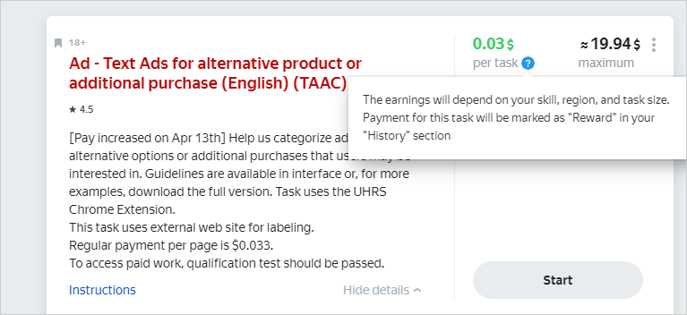

# UHRS - Public FAQ

This section provides answers to frequently asked questions related to work with UHRS. UHRS (Universal Human Relevance System) is a crowdsourcing platform that supports data labeling with the help of millions of people around the world.



In some Toloka tasks you can face integration with UHRS. It is agreed with the administration of our platform and does not violate the rules of Toloka.

To complete the task, you do not need to register on third-party sites. You open the task in Toloka and follow a unique link to UHRS, where you can perform tasks available to you for two hours. In terms of content, they usually correspond to the subject of the original project. At the end of the session you will receive a reward in Toloka. Please note that reward may not be forwarded to your Toloka account right away, normally this process takes about 2 hours but no more than 24 hours. If it takes longer don't hesitate [to let us know](troubleshooting/support.md#contact) so that we can look into the issue





Toloka does not impose any restrictions on the execution of tasks in other services. But according to the author's rule a user should use a single platform to access UHRS. If you use Toloka to perform UHRS tasks, you should not use your account on Clickworker or any other vendor for UHRS.





The authors of tasks established stricter criteria for selecting annotators on the UHRS platform. If UHRS tasks have never been available to you or if they suddenly disappeared, this may be because:

- Your account doesn't meet one or more criteria for a particular task or the UHRS platform in general. For example, your location and number of languages in your profile matter.
  Make sure that:
  - The location in your profile matches your real location and the geolocation settings on your device. If the data is incorrect or there are differences, you may be banned from accessing the tasks.
    Don't use VPN, anonymizers, or any other services that change your location data.
  - You have no more than 3 languages in your profile.
- The author restricted your access to tasks because you made a lot of mistakes. The author monitors every user's activity on the UHRS platform and can suspend your access to tasks if you make a lot of mistakes or don't follow instructions. Please note: if your access is restricted, you aren't notified about this in Toloka.
- No more tasks are available. The number of tasks and UHRS projects available may change over time. If a particular task isn't on the list right now, it may appear later.





Unfortunately, the author of the project decided not to provide the reason for their decision. Вut you can choose other tasks available in Toloka and try your hand in them.





Alas, there is no provision for reviewing the blocking on the project.





No, being blocked in Toloka doesn't mean that you'll be automatically blocked on the UHRS platform.





This may signify a number of issues. Please contact our [support service](troubleshooting/troubleshooting.md#contact) so that we can look into the matter in more detail.





Task reward should be received in 24 hours. If you face any difficulties with rewards please contact our [support service](troubleshooting/troubleshooting.md#contact).





As a matter of fact, the rate may differ. The final price depends on Toloker's skills, region and task size. All this information you can see in the author's task card by clicking on question mark symbol below the task reward.





You can see how much you've earned while completing tasks using the **Reports** section in UHRS schedule **Total Earnings**.



If you have other questions write to us:

