# How to take a screenshot

A screenshot is a picture of a computer or mobile device screen taken using standard tools or a special program.



#### Take a screenshot



- Computer

  Press the **Print Screen** button (it's sometimes called **PrntScrn**, **PrtScn**, **PrtScr**, or **PrtSc**) on the keyboard, and a snapshot of the entire screen will be copied to the clipboard.
  
  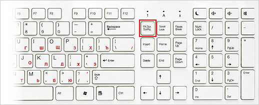
  
  To take a screenshot of the active window, press and hold **Alt + PrtScn**.

- Laptop

  Use the keyboard shortcut **Fn + PrtScn**. Select the area you want to capture. The screenshot will be copied to the clipboard.
  
  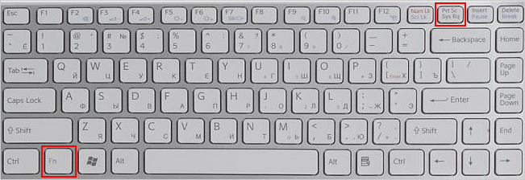
  
  To take a screenshot of the active window, press and hold **Fn + Alt + PrtScn**.





 In Windows 8.1 and above, use the keyboard shortcut Win + PrtScn to quickly take a screenshot of the entire screen and automatically save it to the _Users\(Username)\Pictures\Screenshots_ folder.



#### Paint in Windows

1. To open Paint, go to **Start → Programs → Standard → Paint**.
2. Use the keyboard shortcut **Ctrl + V** or click **Paste** in the top menu of the application (for Windows 7 and above).
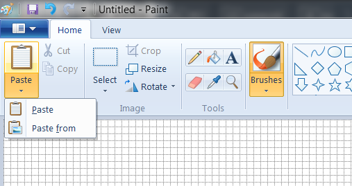
If necessary, add text or highlight image elements.
3. Click **File → Save** as or press .
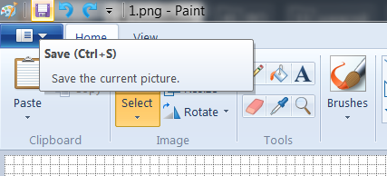



Save image files in JPG or PNG formats, which make the optimal file size to be emailed. In Paint, click **File → Save as** and select a format in the **File type** box.



#### Snipping Tool in Windows

Use the “Snipping Tool” to take a screenshot of a part of your desktop or the entire screen.



- Windows 8-11

  1. Enter `snipping tool` in the search bar and click the application name.
  2. Choose a mode: rectangular or free-form snip. Press **New** and take a screenshot of a window or the entire screen.
  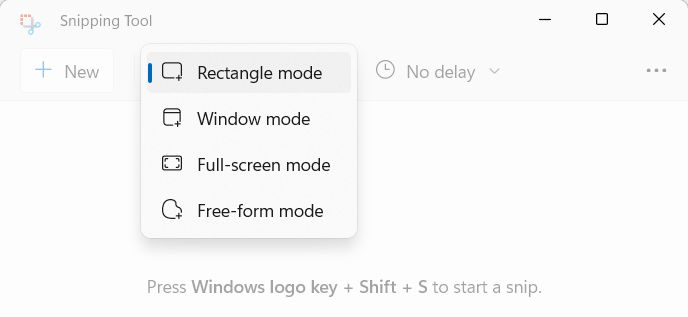
  3. In the editing window, you can write over the image using the **Pen** tool or highlight a part of text with the **Highlighter**.
  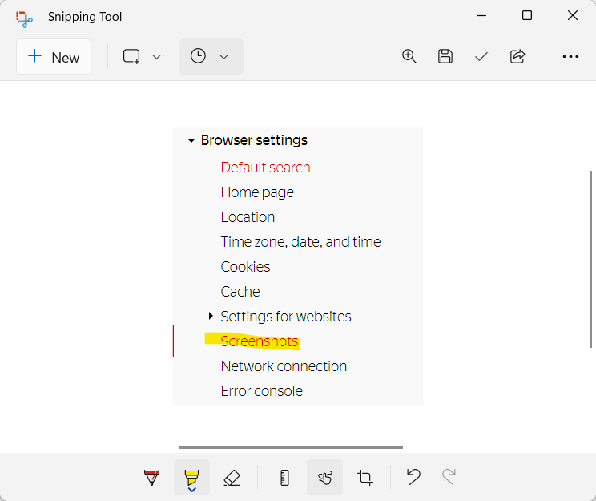
  4. Press **Save as** .

- Windows 7

  1. To find the application, go to Start → Programs → Standard or type `snipping tool` in the search bar and click the application name.
  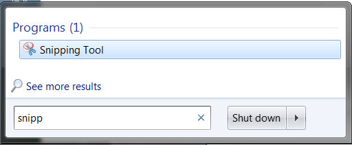
  2. Press **New** and select a rectangular or free-form snip. Take a screenshot of a window or the entire screen.
  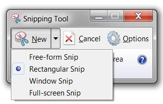
  3. In the editing window, you can write over the image using the **Pen** tool or highlight a part of text with the **Highlighter**.
  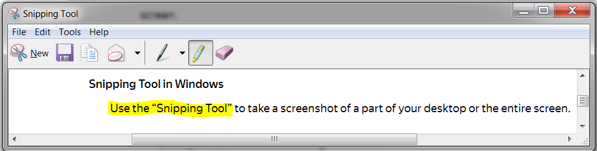
  4. Press **Save as** .







#|
|| Take a screenshot of the computer screen | 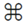 **Cmd + Shift + 3** ||
|| Take a screenshot of a selected area |  **Cmd + Shift + 4** and select the area you want to capture ||
|| Take a screenshot of the active window |  **Cmd + Shift + 3** then press the **spacebar** ||
|| Скопировать скриншот в буфер обмена |  **Cmd + Shift + 3 + Ctrl** ||
|#





To take a screenshot, press and hold the **Volume down** and **Power** buttons for two seconds.

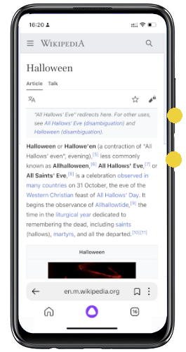

Screenshots are saved in the standard **Gallery** app.



On some smartphone models (for example, Samsung Galaxy S7 and HTC with a Home button), you need to press and hold **Power** and **Home**.









Press and hold the **Top** button and the **Home** button for a few seconds.

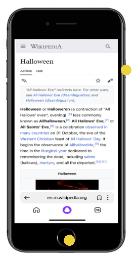





Press and hold the Side button and the **Volume up** button for a few seconds.

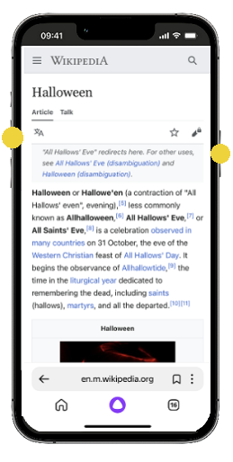



Screenshots are saved in the standard **Photos** app.



In [Yandex Disk](https://yandex.com/support/disk-desktop-windows/screenshots.html) (Windows, macOS)

In [Yandex Browser](https://yandex.com/support/browser/working-with-files/screenshots.html)

