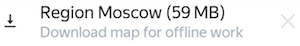

# Required settings

- Choose the [internet usage mode](#internet).
    
- Turn on [push notifications](#notifications-android)[push notifications](#notifications-ios) to instantly learn about events.



- Download a [region map](#map) if you are planning to complete field tasks while offline.



- Turn on [geotags in the camera settings](#camera)[Turn on geo location display](#camera-ios) if you plan to complete field tasks.



- Install an [app for adding multiple photos](#google).



## Internet {#internet}

Choose the internet usage mode depending on the tasks you are planning to complete:



1. Open the menu by tapping  at top-left of the screen. 

1. Select **Settings**.
   




1. Open the **More** → **Settings** page.



1. Set the type of internet connection depending on the task type:

    #### Field tasks
    
    You can complete field tasks without permanent internet connection. You only need the internet to choose and reserve tasks and send responses.
    
    - Wi-Fi only — Turn on **Submit over Wi-Fi only**.
    
        This option saves cellular data. Your responses are stored on your device and are submitted as soon as Wi-Fi is available.
        
        
        
        You need to make sure your responses are submitted before the task time expires.
        
        
    
    - Wi-Fi or mobile network — Turn off **Submit over Wi-Fi only**.
    
        This option means you can send responses immediately after you complete tasks, as soon as you are connected to the internet.
    
    #### Regular (non-field) tasks
    
    Non-field tasks require a constant internet connection.
    
    - Wi-Fi only — Turn on **Submit over Wi-Fi only**.
    
    - Wi-Fi or mobile network — Turn off **Submit over Wi-Fi only**.



## Notifications {#notifications-ios}

Choose which notifications you want to receive and how you want to receive them:

1. Click **More** → **Notification settings**.
    
1. Choose a notification and enable the desired option.





## Notifications {#notifications-android}

Choose which notifications you want to receive and how you want to receive them:

1. Open the menu by tapping  at the top-left of the screen.
1. Select **Settings**.
1. Go to the **Notification settings** block.
1. Turn on the notification and click **Save**.

## Area map {#map}

To use the map when you are offline, download a map of the area to your device.
1. Open the menu by tapping  on the left.
1. Select **Settings**.
1. Turn on the **Download offline maps** option.
1. Tap  → **Available**.
1. Tap  to go to the tasks on the map.
1. Tap  at the top of the screen and save the map:

    

To update the downloaded map automatically:

1. Open **Settings**.
1. Turn on the **Autoupdate** option in the **Maps** section.

To delete downloaded maps:
1. Open **Settings**.
1. Click **Clear** in the **Maps** section.

## Camera {#camera-android}

Many field tasks require you to photograph something (for example, a store's sign). All photos must contain the location information. Otherwise, the requester will reject your response. To save your location in photos:

1. Open the **Camera** app on your device.
1. Go to settings by tapping .
1. Turn on the **GPS location info** option.
    
    
    
    Allow access to your location as the system prompts you to.
    
    

If photos in responses are sent too slowly, choose a lower resolution in the camera settings, but not less than 3 pixels.

## Gallery {#google}

In some field tasks, you need to attach several photos at once (for example, the front of a building and the sign). If doesn't support choosing multiple photos, install the [Google Photos]({{ googleplay-android-photos }}) app.





## Camera {#camera-ios}

Many field tasks require you to photograph something (for example, a store's sign). All photos must contain the location information. Otherwise, the requester will reject your response. To save your location in photos:

1. Go to the device **Settings**.
1. Go to the **Geolocation services** block and allow geolocation access for the **Camera** app.



