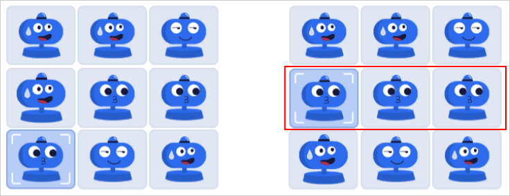

# Ввод капчи

Капча в Толоке — это занимательные мини-игры, которые отвлекут от заданий на несколько секунд. Игры простые, их можно быстро и легко пройти. В капче нет иностранных слов, только картинки и понятные символы. Но при этом она хорошо защищает платформу от роботов и недобросовестных исполнителей.

## Примеры капчи {#example-captcha}

- Капча **Собрать в ряд**

  В этой капче нужно собрать в одном ряду или столбце три одинаковых изображения. Чтобы переместить элемент, нажмите на него, а затем на соседнюю клетку по горизонтали или вертикали. В этой мини-игре всегда есть решение, при котором достаточно передвинуть один элемент, чтобы выстроить одинаковые изображения в ряд.

  

- Капча **Выбор объектов**

  В этой капче нужно отметить элементы в той последовательности, которая указана вверху над картинкой. Чтобы отметить элемент, нажмите как можно ближе к его центру.

  

- Капча **Слайдер**

  Чтобы решить эту капчу, надо переместить элемент в нужное место. Не тяните сам элемент, перемещайте его при помощи ползунка под картинкой. Для этого наведите курсор на ползунок, нажмите кнопку мыши и, удерживая ее, передвигайте ползунок. Не отпускайте кнопку мыши, пока элемент не окажется на своем месте.

  


## Решение проблем {#troubleshooting}





Если вы столкнулись с проблемой при вводе капчи и не нашли ответ на этой странице, напишите в службу поддержки Толоки. К сообщению обязательно приложите скриншот или запись видео с экрана, также укажите ОС, версию браузера или приложения.

