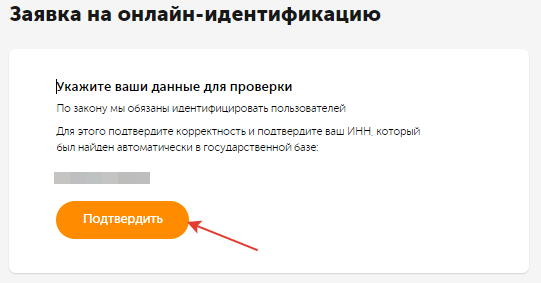
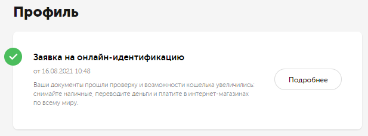

# QIWI 

#### Преимущества QIWI Кошелька

Платежная система с высоким уровнем безопасности, скоростью проведения транзакций и низкими комиссиями.

Позволяет:

- отправлять и получать деньги;
- оплачивать товары и услуги;
- оплачивать коммунальные услуги.

#### Условия





#|
|| Где работает | 



#### Регионы, в которых доступен QIWI Кошелек:



 ||
|| Суммарная комиссия | 

{% cut "от 1% до 3%" %}

#### Комиссии

- Из Толоки — 1%.
- Наличные с карты QIWI — 2% + 50 рублей.
- На карты — 2% + 50 рублей.
- На банковский счет — 1,8% + 120 рублей.

Подробнее читайте на сайте [QIWI.]({{ qiwi-payment }})



||
|| Минимальная сумма вывода | 

0,05 $, если раз в неделю. Последующие платежи в течение недели — 1 $.



 ||
|| Куда вывести дальше | 
- Наличные с карты QIWI.
- На банковскую карту.
- На счет любого банка.
- На любые кошельки.
- Наличные в офисах QIWI: Санкт-Петербург и Казань.
 Подробнее читайте на [QIWI]({{ qiwi }}).||
|#


## Как подключить QIWI Кошелек {#how-to-connect-qiwi }

### Шаг 1. Регистрация {#registration-qiwi}

Для вывода средств из Толоки в QIWI Кошелек необходимо зарегистрироваться в системе.

1. Откройте сайт [QIWI]({{ qiwi }}).
1. Нажмите кнопку **Создать кошелёк.**
1. Введите номер мобильного телефона и нажмите кнопку **Продолжить**.
1. Введите код из SMS и нажмите **Подтвердить**.
1. Придумайте надежный пароль и нажмите кнопку **Зарегистрироваться**.
1. Готово, вы зарегистрировались в QIWI.

### Шаг 2. Пройти идентификацию  {#identification-qiwi}

Чтобы вывести средства из Толоки, нужно иметь идентифицированный QIWI Кошелек.

1. Откройте сайт [QIWI]({{ qiwi }}) и войдите в аккаунт.
1. В правом верхнем углу нажмите на аватарку → **Профиль** → **Пройти идентификацию** → **Получить статус Основной**.
1. Заполните персональные данные и нажмите **Подтвердить данные**.
1. Проверьте ваш ИНН и нажмите **Подтвердить**.

   
    
1. Дождитесь уведомления об успешной идентификации.

   
    
1. Готово, ваш кошелек идентифицирован.

### Шаг 3. Привязать банковскую карту {#add-card-qiwi}

Чтобы выводить средства на карту, привяжите ее:

1. Откройте сайт [QIWI]({{ qiwi }}) и войдите в аккаунт.
1. На верхней панели меню нажмите **Карты QIWI → Привязать карту другого банка**.
1. Заполните данные и нажмите кнопку **Добавить**.
1. Введите проверочный код из SMS.
1. Готово, вы привязали карту.

## Как вывести из Толоки {#how-to-withdraw-toloka}


1. Откройте страницу **Профиль**.

1. Откройте вкладку [Мои деньги]({{ toloka-money }}).

1. В рамке с QIWI Кошелек нажмите кнопку **Вывести**.
1. Привяжите ваш QIWI Кошелек:
    - Подтвердите, что вы указали в профиле имя и фамилию как в паспорте.
    - Введите номер кошелька — телефон, который указали при регистрации. Номер телефона вводится в международном формате, с [кодом страны]({{ qiwi-phone-codes }}), без знака «+».
    Кошелек привязывается один раз, после чего вам будет доступен вывод средств во вкладке **Мои деньги**.
1. Введите необходимую сумму и нажмите кнопку **Вывести**.
1. На ваш номер телефона придет SMS с кодом. Введите его и нажмите кнопку **Подтвердить**.
1. Денежные средства поступят на ваш кошелек. Обычно средства поступают за несколько часов или дней, но иногда дольше. Максимально — 30 дней. Проверяйте статус операции в блоке **История операций**.



## Как вывести из QIWI Кошелька {#withdraw-from-qiwi}

1. Откройте сайт [QIWI]({{ qiwi }}) и войдите в аккаунт.
1. На верхней панели меню нажмите **Вывод денег.**
1. Выберите, куда вы хотите перевести средства:
    - на банковскую карту;
    - на счет банка;
    - на другие кошельки или через системы денежных переводов;
    - на счет организации или ИП.
    
1. Заполните данные, впишите нужную сумму и нажмите **Оплатить**.
1. Введите код из SMS.
1. Готово, перевод отправлен.

