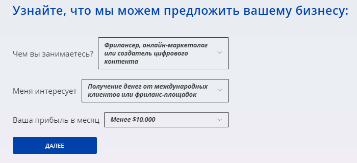

# Payoneer

#### Преимущества Payoneer

Платежная система с высоким уровнем безопасности, скоростью проведения транзакций и низкими комиссиями.

Позволяет:

- отправлять и получать деньги;
- оплачивать товары и услуги;
- отправлять запросы на оплату;
- открыть несколько счетов в разных валютах в рамках одного аккаунта.

#### Условия







#|
|| Где работает |



В России работает с ограничениями.

Доступен в более чем 200 странах. За информацией обращайтесь в [Центр Поддержки Payoneer]({{ payoneer-support }})



||
|| Суммарная комиссия |

{% cut "2%" %}

#### Комиссии

- Из Толоки — 0%.
- На свой банковский счет — до 2%.
- На банковский счет в той же валюте. USD — 1,5 $, EUR —1,5 €, GBP — 1,5 £.

Подробнее на [Сайте Payoneer]({{ payoneer-fees }}).



||
|| Минимальная сумма вывода из Толоки | 20 $ ||
|| Куда вывести дальше | - На свой банковский счет.

- На карту Payoneer Mastercard.

    

    В настоящее время возможны сложности с выводом средств на карты Visa и Mastercard, выпущенные российскими банками.

    

Чтобы уточнить размер комиссии, перейдите в раздел **Тарифы** в вашем аккаунте Payoneer.

Минимальная сумма вывода может отличаться от той, которая была при выводе из Толоки. Она может быть выше, например 50 $. ||
|#

## Как подключить Payoneer {#how-to-use}

Для вывода средств из Толоки в Payoneer необходимо зарегистрироваться в системе.

1. На главной странице официального сайта [Payoneer]({{ payoneer }}) нажмите кнопку **Зарегистрироваться****Register**.
1. Пройдите небольшой опрос, для каких целей вы планируете использовать систему **Payoneer**.

    

	

	

1. На следующей странице нажмите кнопку **Регистрация****Register**.
1. Заполните персональные данные. Нажмите кнопку **Продолжить****Next**.
1. Укажите свои контактные данные. Чтобы подтвердить номер телефона нажмите кнопку **Отправить код** и введите код из SMS.
1. Придумайте пароль и заполните данные удостоверения личности (национального или заграничного паспорта).
1. Введите реквизиты расчетного счета в местном банке.
1. Готово, вы зарегистрировались в Payoneer. После завершения регистрации вы получите на электронную почту уведомление об открытии аккаунта.

## Как вывести из Толоки {#withdraw-from-toloka}


1. Откройте страницу **{{ mobile_ios_profile }}**.

1. Откройте страницу [Мои деньги]({{ toloka-money }}).
1. Найдите платежную систему **Payoneer** и нажмите кнопку **{{ ui_worker_money_PAYONEER__button-link-account }}**.
1. Кошелек привязывается один раз, после чего будет доступен вывод средств во вкладке **{{ ui_worker_prfl-tab-money }}****{{ mobile_android_money_main_title }}****{{ mobile_ios_profile_my_money_section_header }}**.
1. Введите необходимую сумму и нажмите кнопку **{{ ui_worker_money__withdraw__submit }}**.
1. На телефон придет SMS с кодом. Введите его и нажмите кнопку **{{ ui_worker_sms_popup__submit }}****{{ mobile_android_button_confirm_sms }}**.
1. Денежные средства поступят на ваш счет в Payoneer. Обычно средства поступают за несколько часов или дней, но иногда дольше. Максимально — 30 дней. Проверяйте статус в блоке **{{ ui_worker_prfl-money-history }}**.



## Как вывести из Payoneer {#withdraw-from-payoneer}



1. Зайдите в раздел **Вывод → На банковский счет****Withdraw → To Bank Account**.
1. Выберите тип баланса — доллары или евро.
1. Добавьте реквизиты расчетного счета в банке, если вы не делали этого раньше. Если указывали, то выберите из списка.
1. Укажите сумму и нажмите кнопку **Просмотр****Review**.
1. Проверьте сводную информацию и нажмите кнопку **Вывод средств**.
1. После успешной обработки запроса на почту придет уведомление о том, в течение какого срока деньги поступят на банковский счет.





Выводите деньги через банкоматы по всему миру. Для этого закажите карту Payoneer Mastercard в разделе **Настройки → Управление картой → Заказать сейчас**.



Payoneer не выдает карты клиентам, имеющим почтовый или фактический адрес в Российской Федерации.



- Заказ доступен после достижения лимита в получении платежей на определенную сумму.
- Выпуск карты бесплатный, но есть плата за обслуживание.
- Имеется возможность заказать карту для каждой из валют.
- Средства автоматически переводятся со счета Payoneer на карту каждый час при условии, что сумма средств на ней не превышает установленного лимита.

Подробнее о карте читайте в [поддержке Payoneer]({{ payoneer-card }}).



