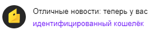

# ЮMoney

#### Особенности ЮMoney

ЮMoney — платежная система, через которую могут выводить средства пользователи Толоки. В ЮMoney легко создать кошелек и идентифицировать его.



Вывод средств через ЮMoney доступен только для граждан РФ, подтвердивших статус [самозанятого](../self-employed/about.md) и указавших Толоку партнером в системе Мой Налог.



#### Условия






#|
|| Где работает | РФ ||
|| Комиссия |

{% cut "от 0,1 до 3,1%" %}

#### Комиссии

- Из Толоки — 0,1% от суммы.
- На банковский счет — 3% от суммы + 15 рублей.
- На карты — 3% от суммы + 45 рублей.

Подробнее на [Сайте ЮMoney]({{ yoomoney-fees }})



||
|| Минимальная сумма вывода |



0,02 \$, если раз в неделю. Последующие платежи в течение недели — 1 \$.



||
|| Способ вывода |
- Перевод на&nbsp;[банковскую карту]({{ yoomoney-transfer-card }}), [счет]({{ yoomoney-transfer-account }}) или на&nbsp;электронный кошелек [Qiwi]({{ yoomoney-transfer-qiwi }}).
- Вывод денег через [Систему быстрых платежей]({{ yoomoney-transfer-systems }}) (доступно только в мобильном приложении ЮMoney).
- Совершение покупок в&nbsp;интернете, оплата [квитанций]({{ yoomoney-charges-bills }}) и [штрафов]({{ yoomoney-charges-fines }}).
- Оформление [пластиковой]({{ yoomoney-card-plastic }}) или [виртуальной]({{ yoomoney-card-virtual }}) карты «Мир», а также платежных стикеров для совершения покупок или вывода денег. 
- [Бесконтактные платежи]({{ yoomoney-payments-contactless }}).||
|#


## Как подключить ЮMoney {#how-to-use}



Чтобы вывести средства из&nbsp;Толоки, нужно иметь [идентифицированный](#identification-wallet) кошелек ЮMoney.



### Шаг 1. Регистрация {#register}

1. Откройте сайт [ЮMoney]({{ yoomoney }}).
1. Нажмите кнопку **Зарегистрироваться**.
1. Укажите ваш номер мобильного телефона и нажмите **Дальше**. Введите последние четыре цифры номера, с которого вам позвонят, или получите SMS с кодом.
1. Введите электронную почту и нажмите кнопку **Получить письмо с кодом**. Введите код из&nbsp;письма.
1. Придумайте надежный пароль и повторите его. Нажмите кнопку **Готово**.
1. Отлично, теперь вы зарегистрированы в&nbsp;ЮMoney.

### Шаг 2. Пройти идентификацию {#identification-wallet}

1. Откройте сайт [ЮMoney]({{ yoomoney }}) и войдите в&nbsp;аккаунт.
1. Перейдите на&nbsp;страницу [идентификации]({{ yoomoney-identification }})&nbsp;и&nbsp;нажмите кнопку **Хочу такой кошелёк**.
1. Выберите [способ идентификации]({{ yoomoney-methods }}):
    - онлайн через СберID, МТС, МегаФон или Билайн;
    - в офисах сети [Связной]({{ yoomoney-id-svyaznoy }}) и [МегаФон]({{ yoomoney-id-megafon }});
    - посетив&nbsp;офис компании на&nbsp;ваш выбор;
    - отправив&nbsp;заверенные документы по&nbsp;почте.

    

    Быстрее всего&nbsp;пройти идентификацию с помощью СберID, МТС, МегаФон или Билайн&nbsp;— это&nbsp;займет несколько&nbsp;минут.

    

1. Пройдите идентификацию выбранным способом.

	

	- Онлайн

	  Если у вас есть аккаунт в&nbsp;СберБанк Онлайн, номер МТС, МегаФон или Билайн, оформленный на&nbsp;ваш паспорт, то&nbsp;пройдите идентификацию онлайн&nbsp;— это&nbsp;самый быстрый способ.

      Следуйте указаниям и проверьте данные. Если все верно, подтвердите&nbsp;— кошелек сразу станет идентифицированным.

    - В городе

	  Пройти идентификацию можно в [наших офисах]({{ yoomoney-id-office }}) или в офисах [агентов]({{ yoomoney-id-agents }}), салонах [МегаФон]({{ yoomoney-id-megafon }}) и [Связной]({{ yoomoney-id-svyaznoy }}). Также заявление можно отправить [почтой]({{ yoomoney-id-post }}).

      - Проверьте требования для прохождения идентификации через выбранного посредника.
      - Приготовьте документы и запишите номер кошелька перед посещением. Если отправляете заявление по&nbsp;почте&nbsp;— заверьте документы у нотариуса.
      - Подтвердите идентификацию на&nbsp;сайте ЮMoney или в&nbsp;приложении. Перейдите по&nbsp;ссылке, которая придет в&nbsp;уведомлении, и проверьте данные. Если все верно, подтвердите&nbsp;— кошелек сразу станет идентифицированным.

    

1. Дождитесь уведомления об успешной идентификации.

   
1. Готово, ваш кошелек идентифицирован.

### Шаг 3. Привязать банковскую карту {#add-card}

Чтобы выводить средства на&nbsp;карту, привяжите ее:

1. Откройте сайт [ЮMoney]({{ yoomoney }}) и войдите в&nbsp;аккаунт.
1. В&nbsp;правом верхнем углу нажмите на&nbsp;аватарку. Выберите **Перейти в настройки → Привязанные карты → Привязать карту**.
1. Заполните данные и нажмите кнопку **Продолжить**. Кошелек пополнится на&nbsp;1&nbsp;рубль, комиссия&nbsp;— 1&nbsp;копейка.
1. Введите проверочный код из&nbsp;SMS.
1. Готово, вы привязали карту.

## Как вывести из&nbsp;Толоки {#how-to-withdraw}



Кошельки бывают трех типов:
- Анонимные — выдаются автоматически после регистрации.
- Именные — выдаются после заполнения онлайн-анкеты гражданами РФ.
- Идентифицированные — выдаются после подтверждения полных паспортных данных. Это единственный тип, на который можно выводить средства из Толоки.
 Перед выводом убедитесь, что ваш кошелек [идентифицирован](#identification-wallet).




1. Откройте страницу {{ mobile_ios_profile }}.

1. Откройте вкладку [Мои деньги]({{ toloka-money }}).

1. В рамке с ЮMoney нажмите кнопку **{{ ui_worker_money__withdraw__submit }}**.
1. Привяжите ваш кошелек ЮMoney:
    - Подтвердите, что вы указали в профиле имя и фамилию как в паспорте.
    - Введите номер кошелька, который начинается на 41001.
    Кошелек привязывается один раз, после чего вам будет доступен вывод средств во вкладке  **{{ ui_worker_prfl-tab-money }}****{{ mobile_android_money_main_title }}**  **{{ mobile_ios_profile_my_money_section_header }}** .
1. Введите необходимую сумму и нажмите кнопку .
1. На ваш номер телефона придет SMS с кодом. Введите его и нажмите кнопку **Подтвердить**.
1. Денежные средства поступят на ваш кошелек. Обычно средства поступают за несколько часов или дней, но иногда дольше. Максимально — 30 дней. Проверяйте статус операции в блоке **{{ ui_worker_prfl-money-history }}**.



## Как вывести из&nbsp;ЮMoney {#withdraw-from-yoomoney}



Перед выводом средств&nbsp;ознакомьтесь с информацией о&nbsp;[лимитах и комиссиях]({{ yoomoney-transfer }}).



1. Откройте сайт [ЮMoney]({{ yoomoney }}) и войдите в&nbsp;аккаунт.
1. Вверху на главной странице кошелька, выберите&nbsp;**Переводы**.
1. Выберите, куда вы хотите перевести средства:
    - на&nbsp;банковскую карту;
    - в&nbsp;другую платежную систему;
    - на&nbsp;банковский счет физлица;
    - юрлицу или ИП.

1. Впишите сумму для перевода и нажмите **Продолжить**.
1. Проверьте свой запрос. Иногда может понадобиться добавить свои данные. Нажмите **Заплатить**.
1. Введите код из SMS.
1. Готово, перевод отправлен.

