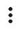

# Задания на проверке

Некоторые задания проходят проверку. Заказчик может отклонить задание, если оно выполнено не по инструкции. Отклоненные задания не оплачиваются.

## Сколько времени занимает проверка {#deadline}

Проверка может занять несколько дней. Максимальный и средний срок проверки указан в информации о задании.

## Как узнать результат {#result}


Историю выполненных заданий можно посмотреть на странице [{{ ui_worker_prfl }} → {{ ui_worker_prfl-tab-history }}]({{ toloka-profile-history }}).



Чтобы узнать результат, перейдите на страницу **{{ mobile_android_tasks_done }}****{{ mobile_ios_my_tasks }} → {{ mobile_ios_done_tasks }}**

Там же вы можете посмотреть всю историю выполненных заданий (сумму заработка, количество принятых и отклоненных заданий) и статистику за день. Чтобы посмотреть статистику, нажмите кнопку с количеством выполненных заданий рядом с датой.


Если ваше задание отклонили, вы не сможете его выполнить повторно. Вы можете [оспорить результат проверки](#appeal).

## Когда будут оплачены принятые задания {#pay}


Сразу после проверки деньги за принятые задания зачисляются на ваш счет. Справа в верхнем меню [Толоки]({{ toloka }}) указаны суммы :



Сразу после проверки деньги за принятые задания зачисляются на ваш счет. В верхней части меню (значок ) указаны суммы :



- серым цветом — стоимость заданий, которые находятся на проверке;

- зеленым цветом — деньги, начисленные на счет в Толоке.



Чтобы посмотреть историю заработка, перейдите на страницу **{{ mobile_android_money_main_title }} → {{ mobile_android_money_income_tab_title }}**. Там вы увидите список принятых заданий с датой и суммой.


Сразу после проверки деньги за принятые задания зачисляются на ваш счет. Чтобы увидеть, сколько денег на вашем счету, откройте **{{ mobile_ios_profile }}**. Отдельно указана стоимость заданий, которые находятся на проверке.

Чтобы посмотреть историю заработка, откройте **{{ mobile_ios_income_log_title }}**. Там вы увидите список принятых заданий с датой и суммой.

## Как оспорить результат проверки {#appeal}

В течение 7 дней после проверки вы можете подать апелляцию заказчику.

На каждое отклоненное задание нужно подавать отдельную апелляцию.


1. Перейдите на страницу **[{{ui_worker_prfl}} → {{ui_worker_prfl-tab-history}}]({{ toloka-profile-history }})**.
1. Выберите **{{ ui_worker_assgn-type-rej }}** в выпадающем списке над таблицей **{{ ui_worker_incm-head }}**.
1. Нажмите на проект.
1. Откройте отклоненное задание, нажав на его номер.
1. Нажмите кнопку ** → {{ui_worker_messages_compose_to_requesters}}** вверху страницы.
1. Кратко опишите, почему вы считаете, что задание выполнено верно. Номер задания будет прикреплен к сообщению автоматически.
1. Нажмите кнопку **Отправить**.

1. Перейдите на страницу **{{ mobile_ios_my_tasks }} → {{ mobile_ios_done_tasks }}**.
1. Откройте отклоненное задание.
1. Нажмите кнопку **{{ ui_worker_messages_compose_to_requesters }}**.
1. Кратко опишите, почему вы считаете, что задание выполнено верно. Номер задания будет прикреплен к сообщению автоматически.
1. Нажмите кнопку **Отправить**.

1. Перейдите на страницу **{{ mobile_android_tasks_done }}**.
1. Откройте отклоненное задание.
1. Нажмите  в карточке задания и выберите **{{ ui_worker_messages_compose_to_requesters }}**.
1. Кратко опишите, почему вы считаете, что задание выполнено верно. Номер задания будет прикреплен к сообщению автоматически.
1. Нажмите кнопку **Отправить**.


Заказчик ответит на апелляцию в течение 14 дней.



Не отправляйте повторные запросы и просьбы ответить скорее, иначе ваш запрос сдвинется в конец очереди: письма автоматически сортируются по времени получения.



## Если связаться с заказчиком не получается или что-то не работает {#support}

