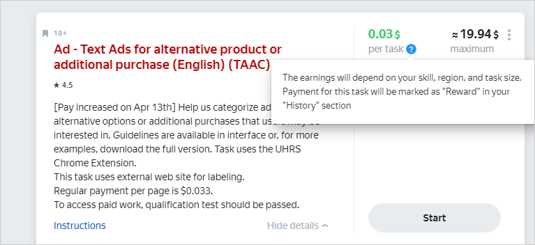
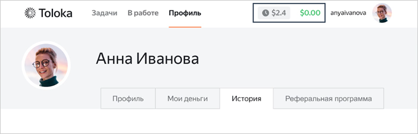

# Вопросы и ответы по UHRS

В разделе приведены ответы на часто задаваемые вопросы при работе с UHRS. UHRS (Universal Human Relevance System) — это краудсорсинговая платформа, которая используется для разметки данных с помощью миллионов людей по всему миру.



В некоторых задачах Толоки вы можете встретиться с интеграцией с UHRS. Она согласована с администрацией Толоки и не нарушает правил платформы.

Для выполнения задания не нужно регистрироваться на сторонних сайтах. Вы открываете задание в Толоке и переходите по уникальной ссылке на UHRS, где можете выполнять доступные вам задания в течение двух часов. По содержанию они обычно соответствуют тематике исходного проекта. В конце сессии вы получите вознаграждение в Толоке. Обратите внимание, что денежные средства могут быть отправлены на ваш счет в Толоке не сразу. Обычно этот процесс занимает 2 часа, но не более 24 часов. Если это займет больше времени, [сообщите нам](troubleshooting/support.md#contact), чтобы мы могли разобраться в проблеме.





Толока не накладывает никаких ограничений на выполнение задач в других сервисах. Но по правилам UHRS пользователь должен использовать один сервис для доступа к этой платфоме. Если вы используете Толоку для выполнения задач UHRS, не используйте свою учетную запись в Clickworker или другом сервисе для UHRS.





Авторами установлены более строгие критерии отбора исполнителей для выполнения заданий на платформе UHRS. Если задания UHRS никогда не попадались вам в списке доступных или внезапно исчезли, это может быть связано с одной из причин:

- Характеристики вашего аккаунта не удовлетворяют одному или нескольким критериям, установленным в конкретном задании или на платформе UHRS в целом. Например, важно местоположение пользователя и количество подтвержденных языков, указанное в профиле.
  Проверьте, что:
  - Место жительства, указанное в профиле, соответствует вашему реальному местонахождению и настройкам геолокации на вашем устройстве. Если данные будут указаны неверно или между ними есть различия, вам может быть заблокирован доступ к заданиям.
    Не используйте VPN, анонимайзеры или аналогичные сервисы, изменяющие информацию о вашем местоположении.
  - Вы подтвердили в профиле не более 3 языков.
- Автор ограничил вам доступ к заданиям за низкое качество их выполнения. Автор следит за деятельностью каждого пользователя на платформе UHRS и может приостановить доступ к заданиям, если обнаружит много ошибок или неисполнение инструкций. Обратите внимание, что в случае ограничения доступа вы не получите об этом уведомления в Толоке.
- Задания закончились. Количество заданий и доступные проекты UHRS могут меняться с течением времени. Если сейчас вы не видите в списке то или иное задание, возможно оно появится позже.





К сожалению, автор проекта решил не указывать причину своего решения. Но вы можете выбрать другие задания, доступные в Толоке, и попробовать в них свои силы.





К сожалению, пересмотра блокировки на проекте нет.





Нет, блокировка в Толоке не означает, что вы автоматически будете заблокированы на платформе UHRS.





Это может означать ряд проблем. Пожалуйста, свяжитесь с нашей [службой поддержки](troubleshooting/support.md#contact), чтобы мы могли более подробно разобраться в этом вопросе.





Стоимость заданий может отличаться. Итоговая стоимость зависит от навыков исполнителя, региона и объема задания. Чтобы увидеть эту информацию, в карточке задания под стоимостью нажмите на знак вопроса.





Сумму вознаграждения за выполненные задания можно посмотреть на UHRS в разделе **Reports** на графике **Total Earnings**.







После того, как вы закрыли сессию на внешней платформе, подсчитывается: сколько заданий вы сделали и какое вознаграждение за них полагается. В течение 24 часов UHRS отправляет деньги на ваш счет в Толоке. Начисленные средства сначала недоступны для вывода, потому что задания отправляются на проверку. Срок проверки — до 7 дней. После отложенной приемки деньги можно будет вывести.


В правом верхнем углу аккаунта указаны суммы:

* серым цветом — стоимость заданий, которые находятся на проверке;
* зеленым цветом — средства на вашем балансе, которые можно вывести из Толоки.


В левом верхнем углу экрана нажмите значок . Рядом с вашим портретом будут указаны суммы:
* белым цветом — стоимость заданий, которые находятся на проверке;
* черным цветом — средства на вашем балансе, которые можно вывести из Толоки.


В разделе **Профиль** указаны суммы:
* серым цветом — стоимость заданий, которые находятся на проверке;
* черным цветом — средства на вашем балансе, которые можно вывести из Толоки.







UHRS отправляет вознаграждение на ваш счет в Толоке в течение 24 часов. Начисленные средства становятся доступны для вывода после проверки, которая занимает до 7 дней. До этого момента сумма отображается как серая в правом верхнем углу аккаунта.До этого момента сумма отображается белым цветом рядом с вашим потретом.До этого момента сумма отображается как серая в разделе **Профиль**. Если у вас возникнут трудности с вознаграждением, обратитесь в нашу [службу поддержки](troubleshooting/support.md#contact).



Если у вас остались вопросы, напишите нам:

