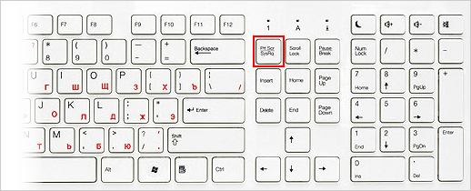

# Как сделать скриншот

Скриншот (от англ. screenshot) — это снимок экрана компьютера или мобильного устройства, сделанный с помощью стандартных средств или специальной программы.



#### Сделать скриншот



- Компьютер

  Нажмите на клавиатуре кнопку **Print Screen** (иногда она называется **PrntScrn**, **PrtScn**, **PrtScr** или **PrtSc**) — в буфер обмена скопируется снимок всего экрана.

  

  Чтобы сделать скриншот только активного окна, удерживайте сочетание клавиш **Alt + PrtScn**.

- Ноутбук

  Нажмите сочетание клавиш **Fn + PrtScn**. Выберите нужную область. Снимок будет скопирован в буфер обмена.

  

  Чтобы сделать скриншот только активного окна, удерживайте сочетание клавиш **Fn + Alt + PrtScn**.





В Windows 8.1 и выше используйте сочетание клавиш **Win + PrtScn**, чтобы быстро снять скриншот всего экрана и автоматически сохранить его в папке _Пользователи\(Имя)\Изображения\Снимки экрана_.



#### Программа Paint в Windows

1. Откройте Paint: **Пуск → Программы → Стандартные → Paint**.
2. Нажмите сочетание клавиш **Ctrl + V** или в верхнем меню программы нажмите кнопку **Вставить** (для Windows 7 и выше).

При необходимости добавьте текст или выделите элементы изображения.
3. Нажмите **Файл → Сохранить как** или кнопку .



Сохраняйте графические файлы в формате JPG или PNG: тогда размер файла будет оптимальным для отправки по почте. В Paint нажмите **Файл → Сохранить как** и в поле **Тип файла** выберите формат.



#### Программа «Ножницы» в Windows

«Ножницы» позволяют сделать скриншот части рабочего стола или всего экрана.



- Windows 8-11

  1. Наберите слово `ножницы` в поисковой строке и нажмите на название программы.
  
  2. Выберите режим: прямоугольная или произвольная форма, нажмите кнопку **Создать** и сделайте снимок отдельного окна или всего экрана.
  
  3. В окне редактирования изображения вы можете сделать подпись **Ручкой** или выделить текст **Маркером**.
  
  4. Нажмите кнопку **Сохранить как** .

- Windows 7

  1. Найдите программу в меню **Пуск → Все программы → Стандартные** или наберите слово `ножницы` в поисковой строке и нажмите на название программы.
  
  2. Нажмите кнопку **Создать** и выберите область: прямоугольную или произвольную форму, сделайте снимок отдельного окна или всего экрана.
  
  3. В окне редактирования изображения вы можете сделать подпись **Пером** или выделить текст **Маркером**.
  
  4. Нажмите кнопку **Сохранить как** .







#|
|| Сделать скриншот экрана компьютера | ⌘ **Cmd + Shift + 3** ||
|| Сделать скриншот выделенной области | ⌘ **Cmd + Shift + 4** и выделите курсором нужную область экрана ||
|| Сделать скриншот активного окна | ⌘ **Cmd + Shift + 3**, а затем нажмите **Пробел** ||
|| Скопировать скриншот в буфер обмена | ⌘ **Cmd + Shift + 3 + Ctrl** ||
|#





Чтобы снять скриншот, нажмите и удерживайте пару секунд кнопки **Уменьшение громкости** и **Питание**.

Снимки сохраняются в стандартном приложении **Галерея**.



На некоторых моделях смартфонов (например, Samsung Galaxy S7, HTC с кнопкой **Домой**) понадобится нажать и удерживать кнопки **Питание** и **Домой**.









Нажмите и удерживайте несколько секунд кнопки **Включение/Выключение** и **Домой**.





Нажмите и удерживайте несколько секунд кнопки **Включение/Выключение** и **Повышение громкости**.



Снимки сохраняются в стандартном приложении **Фото**.



В [Яндекс Диске](https://yandex.ru/support/disk-desktop-windows/screenshots.html) (Windows, macOS)

В [Яндекс Браузере](https://yandex.ru/support/browser/working-with-files/screenshots.html)

