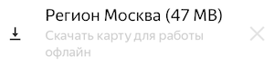

# Необходимые настройки

- Выберите [режим использования интернета](#internet).
    
- Включите [push-уведомления](#notifications-android)[push-уведомления](#notifications-ios), чтобы мгновенно узнавать о событии.

    
- Скачайте [карту региона](#map), чтобы выполнять полевые задания офлайн.

    
- Включите [геотеги в настройках камеры](#camera)[Включите отображение геопозиции](#camera-ios), если собираетесь выполнять полевые задания.


- Установите [приложение для добавления нескольких фотографий](#google).


## Интернет {#internet}

Выберите режим использования интернета в зависимости от того, какие задания вы собираетесь выполнять:
1. Откройте меню, нажав кнопку  слева вверху экрана. Откройте страницу **{{ mobile_ios.more_title }} → {{ mobile_ios.settings.screen_title }}**.

1. Выберите **{{ mobile_android.settings }}**.

1. Установите тип интернет-соединения в зависимости от вида задания:
    #### Полевые задания
    
    Полевые задания можно выполнять без постоянного доступа к интернету. Интернет нужен, только чтобы выбирать, резервировать задания и отправлять ответы.
    
    - Только Wi-Fi — включите **{{ mobile_android.settings_wifi_title }}**.
    
    Этот вариант экономит мобильный трафик. Ответы сохранятся на вашем устройстве и будут отправлены, как только появится доступ к Wi-Fi.
	
    
    
    Нужно успеть отправить ответы до того, как истечет срок выполнения задания.
    
    
    
    - Wi-Fi или мобильная сеть — отключите **{{ mobile_android.settings_wifi_title }}**.
    
    Этот вариант позволяет отправлять ответы сразу после выполнения задания, как только появится доступ к интернету.
    
    #### Обычные задания
    
    Обычные задания требуют постоянного доступа к интернету.
    
    - Только Wi-Fi — включите **{{ mobile_android.settings_wifi_title }}**.
    
    - Wi-Fi или мобильная сеть — отключите **{{ mobile_android.settings_wifi_title }}**.


## Уведомления {#notifications-android}

Выберите, какие уведомления и каким способом вы хотите получать:

1. Откройте меню, нажав слева вверху экрана кнопку .
1. Выберите **{{ mobile_android.settings }}**.
1. Перейдите в блок **{{ mobile_android.notifications_title }}**.
1. Включите уведомление и нажмите кнопку **{{ mobile_android.action_save }}**.


## Уведомления {#notifications-ios}

Выберите, какие уведомления и каким способом вы хотите получать:
1. Нажмите **{{ mobile_ios.more_title }} → {{ mobile_ios.notifications_preferences.title }}**.
1. Выберите уведомление и включите нужную опцию.



## Карта региона {#map}

Чтобы пользоваться картой без подключения к интернету, скачайте карту региона на устройство: 
1. Откройте меню, нажав кнопку  слева.
1. Выберите **{{ mobile_android.settings }}**.
1. Включите опцию **{{ mobile_android.settings__download_maps__title }}**.
1. Нажмите  → **Доступные** → **Available**.
1. Нажмите значок , чтобы перейти к заданиям на карте.
1. Нажмите на значок  в нижней части экрана и сохраните карту: 

   

Чтобы скачанная карта автоматически обновлялась:

1. Откройте **{{ mobile_android.settings }}**.
1. Включите опцию **{{ mobile_android.settings_offline_maps_auto_update__title }}** в разделе **{{ mobile_android.support_help_settings_maps_group }}**.

Чтобы удалить скачанные карты:
1. Откройте **{{ mobile_android.settings }}**.
1. Нажмите кнопку **{{ mobile_android.clear }}** в разделе **{{ mobile_android.support_help_settings_maps_group }}**.


## Камера {#camera}

Часто в полевых заданиях требуется сфотографировать что-либо (например, вывеску магазина). Все фотографии должны содержать информацию о месте съемки, иначе задание будет отклонено заказчиком. Чтобы сохранять местоположение в фотографиях:
1. Откройте приложение КамераCamera на вашем устройстве.
1. Перейдите в настройки, нажав кнопку .
1. Включите опцию **Геометки**/**Геотеги****GPS location info**.

    
    
    Нужно принять запрос системы на разрешение доступа.
    
    

Если фотографии в ответах отправляются слишком медленно, выберите более низкое разрешение в настройках камеры, но не ниже 3 мегапикселей.


## Камера {#camera-ios}

Часто в полевых заданиях требуется сфотографировать что-либо (например, вывеску магазина). Все фотографии должны содержать информацию о месте съемки, иначе задание будет отклонено заказчиком. Чтобы сохранять местоположение в фотографиях:
1. Зайдите в **Настройки** вашего устройства.
1. Перейдите в блок **Службы геолокации** и разрешите доступ к геолокации для приложения **Камера**.


## Галерея {#google}

В некоторых полевых заданиях требуется прикрепить сразу несколько фотографий (например, фасад и вывеску). Если **{{ mobile_android.support_help_settings_images_gallery_title }}** не поддерживает множественный выбор, установите приложение [Google Фото]({{ googleplay-android-photos }})[Google Photos]({{ googleplay-android-photos }}).



