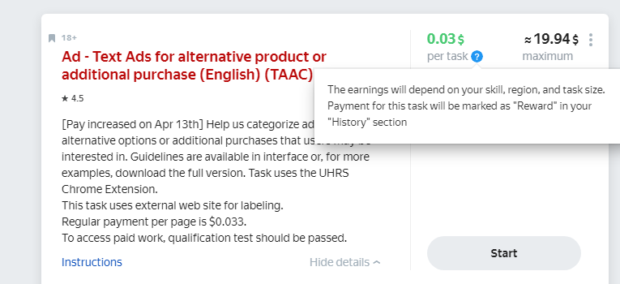

# Вопросы и ответы по UHRS

В разделе приведены ответы на часто задаваемые вопросы при работе с UHRS. UHRS (Universal Human Relevance System) — это краудсорсинговая платформа, которая используется для разметки данных с помощью миллионов людей по всему миру.



В некоторых задачах Толоки вы можете встретиться с интеграцией с UHRS. Она согласована с администрацией Толоки и не нарушает правил платформы.

Для выполнения задания не нужно регистрироваться на сторонних сайтах. Вы открываете задание в Толоке и переходите по уникальной ссылке на UHRS, где можете выполнять доступные вам задания в течение двух часов. По содержанию они обычно соответствуют тематике исходного проекта. В конце сессии вы получите вознаграждение в Толоке. Обратите внимание, что денежные средства могут быть отправлены на ваш счет в Толоке не сразу. Обычно этот процесс занимает 2 часа, но не более 24 часов. Если это займет больше времени, [сообщите нам](troubleshooting/troubleshooting.md#no_tasks), чтобы мы могли разобраться в проблеме.





Толока не накладывает никаких ограничений на выполнение задач в других сервисах. Но по правилам UHRS пользователь должен использовать один сервис для доступа к этой платфоме. Если вы используете Толоку для выполнения задач UHRS, не используйте свою учетную запись в Clickworker или другом сервисе для UHRS.





Авторы задач в Толоке могут устанавливать различные фильтры для распространения своих задач через нашу платформу. Если вы не видите интересующий вас проект в списке на главной странице, это может быть связано с одной из причин:

- проект неактивен в данный момент;
- характеристики вашего аккаунта не удовлетворяют одному или нескольким критериям, установленным автором проекта;
- автор ограничил ваш доступ к проекту.

Для получения более подробной информации, пожалуйста, свяжитесь с нашей [службой поддержки](troubleshooting/troubleshooting.md#no_tasks).





К сожалению, автор проекта решил не указывать причину своего решения. Но вы можете выбрать другие задания, доступные в Толоке, и попробовать в них свои силы.





К сожалению, пересмотра блокировки на проекте нет.





Нет, ваша блокировка в Толоке никак не повлияет на UHRS.





Это может означать ряд проблем. Пожалуйста, свяжитесь с нашей [службой поддержки](troubleshooting/troubleshooting.md#no_tasks), чтобы мы могли более подробно разобраться в этом вопросе.





Награда за задание приходит в течение 24 часов. Если у вас возникнут трудности с вознаграждением, обратитесь в нашу [службу поддержки](troubleshooting/troubleshooting.md#no_tasks).





Стоимость заданий может отличаться. Итоговая стоимость зависит от навыков исполнителя, региона и объема задания. Чтобы увидеть эту информацию, в карточке задания под стоимостью нажмите на знак вопроса.





Сумму вознаграждения за выполненные задания можно посмотреть на UHRS в разделе **Reports** на графике **Total Earnings**.



Если у вас остались вопросы, напишите нам:

