# PayPal



В настоящее время вывод средств на PayPal не доступен для пользователей из России.



#### Преимущества PayPal

Является одной из наиболее популярных платежных систем с высоким уровнем безопасности и скорости проведения транзакций.

#### Условия








#|
|| Где работает | 



#### Регионы, в которых невозможен PayPal-перевод 

  Иран  
  Крым  
  Куба  
  Россия  
  Северная Корея  
  Сирия  
  Судан  
  Турция  
  Узбекистан  
  Украина

Полный список опубликован на [сайте Министерства финансов США]({{ usa-treasury-sanctions }}).



||
||Комиссия | 

{% cut "от 2 до 6%" %}

#### Комиссии

- Из Толоки — 2% от суммы, но не более 7 $.
- На свой банковский счет — бесплатно, если нет конвертации валюты.
- Конвертация в другую валюту — от 3 до 4%.

Подробнее на [Сайте PayPal]({{ paypal-commission }}).



||
||Минимальная сумма вывода | 



0,02 $, если раз в неделю. Последующие платежи в течение недели — 1 $.



||
||Способ вывода | Условия вывода на банковский счет зависят от валюты. Подробнее читайте в [Справке PayPal]({{ paypal-transfer-money }}).||
|#



## Как подключить PayPal {#how-to-use}

### Шаг 1. Регистрация {#how-to-use}

Чтобы вывести средства из Толоки необходимо зарегистрироваться в PayPal.

1. Откройте официальный сайт [PayPal]({{ paypal }}).
    
1. Нажмите кнопку **Открыть счет**.
1. Далее выберите **Личный счет** и нажмите кнопку **Продолжить**.
1. Введите ваш номер телефона. Нажмите **Далее**.
1. Введите код из СМС.
1. Заполните адрес электронной почты и придумайте надежный пароль. Нажмите кнопку **Далее**.

   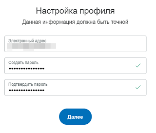
1. Заполните персональные данные и подтвердите открытие счета.
   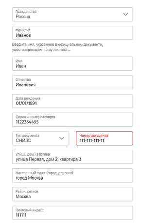
1. Поздравляем. Вы успешно прошли регистрацию.

#### Подтверждение электронной почты

После успешной регистрации вам необходимо подтвердить адрес электронной почты.

1. Войдите в личный кабинет и нажмите на . 

   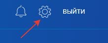
1. В настройках найдите ваш электронный адрес и нажмите кнопку **Подтвердить**.

   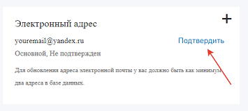
1. На открывшейся странице подтвердите адрес электронной почты. На вашу почту придет письмо с ссылкой для подтверждения.



Основной адрес электронной почты изменить нельзя.



### Шаг 2. Верификация кошелька {#verification-wallet}

Для того, чтобы вывести средства из Толоки вам необходимо верифицировать кошелек.

1. Откройте официальный сайт [PayPal]({{ paypal }}).
1. Зайдите в личный счет.

    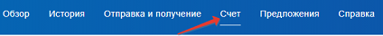 
1. Нажмите **Добавить банковский счет или карту**.
    
    
    Для верификации кошелька достаточно привязать карту. Чтобы вывести средства на банковский счет вам необходимо дополнительно привязать его.
    
    
    
1. Нажмите на кнопку **Привязать банковскую карту**.
1. Заполните данные вашей карты и нажмите **Привязать карту**.
1. С карты спишется сумма в 60 рублей. В банковском чеке вы найдете четырехзначный код подтверждения.

    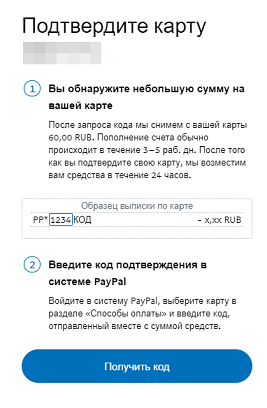

    
    
    Пополнение счета может занимать от трех до пяти рабочих дней.
    
    
    
1. Введите код в поле и нажмите кнопку **Подтвердить карту**.

    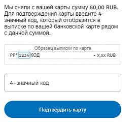
    
	
    
    Если вы не получили код в течении нескольких минут, вы можете подтвердить карту позже.
    
    Для этого зайдите в личный кабинет. В разделе **Счет** выберите карту и нажмите **Введите код для подтверждения**. Введите код в поле и нажмите кнопку **Подтвердить карту**.
	
	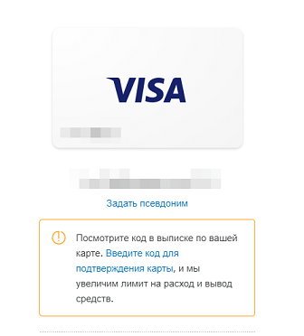
	
	
    
1. Поздравляем. Вы верифицировали кошелек.

#### Добавление банковского счета

Чтобы вывести средства на банковский счет вам необходимо привязать его.

Для этого:

1. Откройте официальный сайт [PayPal]({{ paypal }}).
1. Зайдите в личный счет.
1. Нажмите кнопку **Привязать банковский счет**.
1. Заполните данные и нажмите кнопку **Согласиться и привязать**.
1. На счет будут отправлены две небольшие суммы (менее 0,5 рублей) и осуществлен их возврат.

   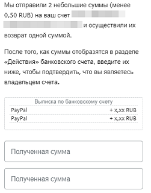
   
    
    
    Пополнение счета может занимать от трех до пяти рабочих дней.
    
    
    
1. Вам необходимо ввести эти суммы в специальные поля и нажать кнопку **Подтвердить**.

    
    
    Если денежные суммы не пришли в течении нескольких минут, вы можете подтвердить банковский счет позже.
    
    Для этого зайдите в личный кабинет. В разделе **Счет** выберите банковский счет и нажмите **Подтвердить банковский счет**. Введите суммы в поля и нажмите кнопку **Подтвердить**.
	
	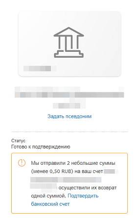
	
	
    
1. Поздравляем. Вы подтвердили банковский счет.

## Как вывести из Толоки {#how-to-withdraw}



Не подавайте заявку на вывод, пока не убедитесь, что ваш аккаунт подтвержден в платежной системе. В противном случае, вам через какое-то время может придти отказ и придется подавать заявку снова.



Чтобы вывести средства вам необходимо привязать кошелек.


1. Откройте страницу **{{ mobile_ios.profile.profile }}**.

1. Откройте страницу [Мои деньги]({{ toloka-money }}).

1. Найдите платежную систему PayPal и нажмите кнопку .
1. Привяжите ваш кошелек PayPal. Кошелек должен быть верифицирован. Привязанный кошелек будет отображаться в разделе **{{ ui_worker.prfl-tab-money }}****{{ mobile_android.money_main_title }}****{{ mobile_ios.profile.my_money_section_header }}**.

    
    
    Кошелек привязывается один раз. После этого вам будет доступен вывод средств.
    
    
    
1. В поле **{{ ui_worker.wthdrw-amnt }}** введите необходимую сумму и нажмите кнопку **{{ ui_worker.money__withdraw__submit }}**.
1. На ваш номер телефона придет СМС с кодом. Введите его и нажмите кнопку **Подтвердить**. 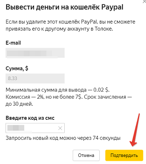
1. Денежные средства поступят на ваш кошелек. Обычно средства поступают за несколько часов или дней, но иногда дольше. Максимально - 30 дней. Проверяйте статус операции в блоке **{{ ui_worker.prfl-money-history }}**.



## Как вывести из PayPal {#withdraw-from-paypal}

Чтобы вывести средства вам необходимо:

1. Перейти на сайт [PayPal]({{ paypal }}).
1. Нажмите **Перевести средства**.
1. Выберите, откуда и куда вы переводите средства.
1. Выберите сумму, которую вы хотите перевести.
1. Нажмите **Продолжить**.
1. Проверьте свой запрос, а затем нажмите **Перевод**.

За вывод средств с остатка на PayPal на счет в местном банке комиссия не взимается. Некоторые банки могут взимать комиссию за перевод. Для получения дополнительной информации свяжитесь с банком напрямую.

Подробнее о комиссиях читайте в [Справке PayPal]({{ paypal-commission }}).

## Решение проблем {#troubleshooting}



Вам необходимо подтвердить адрес электронной почты. Для этого воспользуйтесь [инструкцией](#email).





Вам необходимо верифицировать кошелек в PayPal. Для этого воспользуйтесь [инструкцией](#verification-wallet) по верификации.



