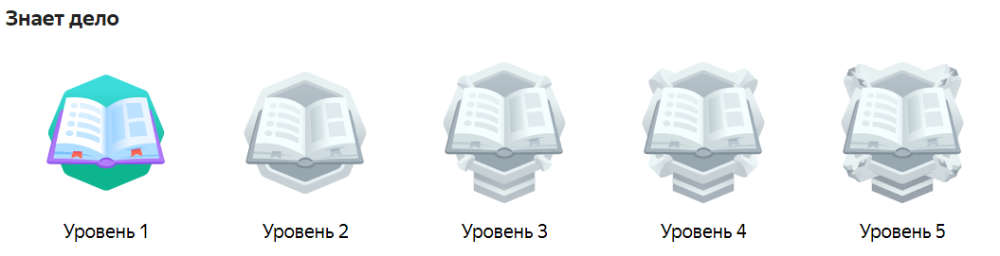

# Награды

Награды — это раздел, где можно посмотреть ваши достижения в Толоке, например, за выполнение заданий и приглашение друзей.



Зайдите на эту [страницу]({{ toloka-achievements }}), чтобы посмотреть, какие достижения существуют. Так вы больше узнаете о возможностях Толоки.



Слева вверху нажмите значок ** → {{ mobile_android.achievements_skills_title }} → {{ mobile_android.achievements_skills_title }}**



Список наград смотрите в разделе **{{ mobile_ios.profile.profile }} → {{ mobile_ios.achievements.awards.title }}**



#|
|| Полученные награды — цветные         | Доступные награды — черно-белые        ||
||   |   ||
|#

Нажмите на награду, чтобы узнать, как ее получить.

## Виды наград {#section_qsd_fmr_r3b}

- **За знание Толоки.** Выполните обучающее задание, пешеходное задание или задание с мобильного, заработайте первые деньги и выведите их со своего счета в Толоке.
- **За активность.** Эти награды вы получите за разные действия на платформе. Например, если включите push-уведомления или пригласите друзей в Толоку.
- **Многоуровневые награды** выдаются при достижении вами определенного уровня. С каждым новым уровнем вы получаете новую награду.

     
	
    Награду «Знает дело» первого уровня вы получите за выполнение десяти обучающих заданий, второго уровня — за выполнение ста обучающих заданий и так далее. Самая высокая награда — пятого уровня.
	
	
	
	
    
- **Секретные** награды не видны в профиле и выдаются сюрпризом.

